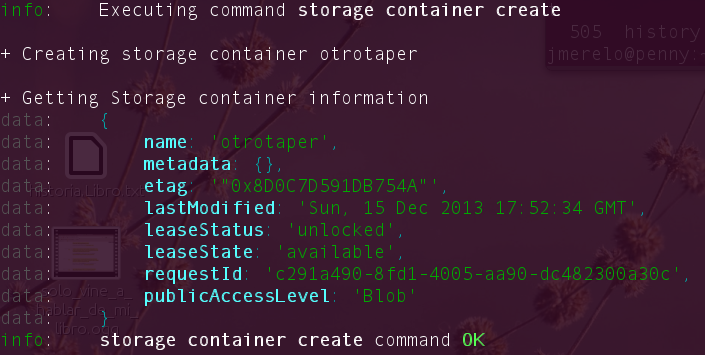

Virtualización del almacenamiento
===

<!--@
prev: Contenedores
next: Uso_de_sistemas
-->

Objetivos
--

### Cubre los siguientes objetivos de la asignatura

* Conocer las diferentes tecnologías y herramientas de virtualización
  tanto para procesamiento, comunicación y almacenamiento. 
  
 * Configurar los diferentes dispositivos físicos para acceso a los
  servidores virtuales: acceso de usuarios, redes de comunicaciones o
  entrada/salida
  
 * Diseñar, implementar y construir un centro de procesamiento de
   datos virtual.
   
 * Realizar tareas de administración en infraestructura virtual.
 
### Objetivos específicos
 
 * Conocer las técnicas de provisionamiento de almacenamiento de datos
   para
   máquinas virtuales.
   
 * Saber usar diferentes órdenes y utilidades para crearlas.
 
 

 
 
## La parte verdadera: un disco físico.
 
 Aunque en principio esté claro que un disco es un disco, en la
 práctica no tiene que ser así. El soporte físico del almacenamiento
 puede ser un disco duro de cualquier formato (rotatorio, SSD), pero
 también una
 [partición](http://en.wikipedia.org/wiki/Partition_%28computing%29)
 de uno, que aparecerá a todos los efectos como un disco físico o lo
 denominado
 [LUN (*Logical Unit Number*)](http://en.wikipedia.org/wiki/Logical_Unit_Number),
 un dispositivo al que se accede usando el protocolo SCSI, un
 protocolo veterano de acceso a discos que permitía conectar varios
 discos cuando nuestro querido SATA sólo podía tener un maestro y un
 esclavo y que se ha licenciado como protocolo para sistemas de discos
 accesibles desde la red, es decir,
 [Storage Area Networks](http://en.wikipedia.org/wiki/Storage_area_network). En
 la práctica, en esta asignatura vamos a usar sobre todo los dos
 primeros pero el segundo se usa en todo centro de datos que se
 precie. 
 
 Cada disco, partición o LUN constituye un volumen físico que tiene
 una serie de bloques llamados *physical extents* (PEs, extensiones
 físicas) y se puede combinar en un [*physical volume group* (PVG,
 grupo de volúmenes físicos)](http://h30499.www3.hp.com/t5/LVM-and-VxVM/what-is-PVG-Physical-Volume-Group/td-p/4675294), de forma que un PE de cada volumen en el PVG se usará de forma combinada a la hora de escribir. 
 
 Esta estructura física se reflejará en la estructura lógica, pero la virtualización lo que hace es transformarla de forma que cada elemento lógico equivalga a uno, varios o ningún elemento físico.  

Los
[volúmenes lógicos](http://en.wikipedia.org/wiki/Logical_volume_management)
son una virtualización habitual en los sistemas operativos.  Un
volúmen lógico crea un LE (*logical extent*) a partir de uno PE o
varios en el caso de que se haga *mirroring* transparente. Los LEs se
agrupan en volúmenes lógicos, que aparecen desde el punto de vista del
sistema operativo como cualquier otra partición. En realidad, el
concepto de partición y el de volumen lógico es similar, salvo que una
partición virtualiza siempre parte de un volumen físico y se hace a
un nivel lógico inferior que el de los volúmenes lógicos. En Linux
estos se suelen usar para manejar la partición extendida y crear más
particiones que las cuatro que admite por defecto el formato de tabla
de particiones usual. 

 

 
 1. ¿Cómo tienes instalado tu disco duro? ¿Usas particiones? ¿Volúmenes lógicos? 
 
2. Si tienes acceso en tu escuela o facultad a un ordenador común para las prácticas, ¿qué almacenamiento físico utiliza? 

3. Buscar ofertas SAN comerciales y comparar su precio con ofertas *locales* (en el propio ordenador) equivalentes.

En
[esta guía](http://www.idevelopment.info/data/Unix/Linux/LINUX_ManagingPhysicalLogicalVolumes.shtml)
hay un resumen de todos los comandos usados para trabajar con
volúmenes físicos y lógicos en Linux.

Sistemas de ficheros en espacio de usuario
-----------------------

Los
[FUSE o sistemas de ficheros en espacio de usuario](http://en.wikipedia.org/wiki/Thin_provisioning)
son *drivers* que permiten proyectar sobre el sistema local recursos
remotos como si se trataran de sistemas de ficheros locales y sin
necesidad de usar órdenes privilegiadas para montarlos. Un ejemplo muy
usado es Dropbox, pero en general casi cualquier recurso que se pueda
*mapear* a una estructura de directorios se puede pasar a una metáfora
de sistema de ficheros y hacerlo mediante un programa. Por ejemplo, un
repositorio remoto de `git` podría usarse de esa forma, accediendo a
ficheros en el mismo como si se tratara de ficheros locales (y, de
hecho, eso es lo que hace
[este programa, `gitfuse`](https://github.com/davesque/gitfuse)), que
sólo permite visualizarlos y que está escrito en Python. 

En Linux se usa la librería [FUSE](http://fuse.sourceforge.net/) para
implementarlo. Se puede usar directamente o mediante alguna adaptación
a
[cualquier lenguaje o a cualquier tipo de sistema](http://sourceforge.net/apps/mediawiki/fuse/index.php?title=FileSystems). Por
ejemplo, se puede usar para acceder a ficheros comprimidos
directamente, o a bases de datos, o a la red, o en realidad a casi
cualquier cosa. Por ejemplo, `sshfs` (que debería estar instalado con
el paquete OpenSSH) permite acceder a ficheros remotos como si fueran
locales con el protocolo ssh.

Usar FUSE para acceder a recursos remotos como si fueran ficheros
locales. Por ejemplo, sshfs para acceder a ficheros de una máquina
virtual invitada o de la invitada al anfitrión. 

*Avanzado* Usar los drivers de FUSE para Ruby
 ([aquí explican más o menos como hacerlo con fusefs](http://www.debian-administration.org/articles/619)
 para mostrar el contenido de una estructura de datos en un lenguaje
 como si fuera un
 fichero. [Este es un ejemplo en Python](http://www.stavros.io/posts/python-fuse-filesystem/). 

El usar la metáfora del sistema de ficheros puede convertir una
estructura de datos remota, o compleja, o simplemente extraña, en una
serie de operaciones perfectamente familiares como leer y escribir en
ficheros o navegar por directorios. Se puede usar tanto
pedagógicamente como para convertir recursos muy diferentes en algo
que pueda ser manejado desde un programa que sólo, o principalmente,
sepa manejar ficheros. En cualquier caso, se trata de un ejemplo
estupendo de virtualización de recursos y de un tipo de recurso que,
también, se puede usar dentro de máquinas virtuales. 

Provisionamiento delgado
----

Una máquina virtual puede usar directamente cualquiera de los
volúmenes físicos o lógicos creados por el sistema operativo, pero lo
más habitual es crear, sobre los volúmenes físicos o lógicos creados por el sistema
operativo,  un almacenamiento virtual en un proceso que se llama
habitualmente
[provisionamiento delgado](http://en.wikipedia.org/wiki/Thin_provisioning). El
término *delgado* indica que el volumen lógico va a tener más espacio
disponible que el espacio físico que realmente ocupa y de forma
práctica se hace creando ficheros en diferentes formatos, ficheros que
serán vistos como un volumen lógico dentro de la máquina virtual con
más espacio del que usan realmente. 

Este almacenamiento virtual puede tener muchos formatos
diferentes. Cada hipervisor, librería, máquina virtual o incluso
[*pools* de recursos admite unos
cuantos; por ejemplo, `libvirt` admite hasta una docena](http://libvirt.org/storage.html). Cualquiera
de estos recursos tendrá que estar disponible (es decir,
*provisionado*) antes de la creación de la máquina virtual, por lo que
conviene *tenerlo a mano* previamente, junto con las herramientas que
trabajan con él. Algunos formatos que son populares son

*
  [`raw` o *poco poblado* (*sparse*)](http://en.wikipedia.org/wiki/Sparse_file):
  son ficheros cuyo formato evita los espacios sin asignar, que se
  representan por metadatos y por lo tanto puede usar en el
  almacenamiento físico menos espacio del asignado inicialmente. Lo
  admiten la mayoría de los sistemas operativos modernos. Para el
  usuario se comportan como los ficheros normales, pero su creación
  necesitará una orden de Linux como esta:
  
	  dd of=fichero-suelto.img bs=1k seek=5242879 count=0
	  
, donde `of` indica el nombre de fichero de salida, `bs` es el tamaño
del bloque y `seek` es el tamaño del fichero en bytes  (menos uno); 
mientras que 

	ls -lks fichero-suelto.img 
	
dice cuantos bloques se han ocupado realmente. También se
[puede hacer](http://stackoverflow.com/questions/257844/quickly-create-a-large-file-on-a-linux-system)
usando `fallocate`:

	fallocate -l 5M fichero-suelto.img
	
lo que tendrá el mismo resultado, aunque este último no funciona en
algunos sistemas de ficheros (como ZFS). 

* [`qcow2`](https://people.gnome.org/~markmc/qcow-image-format.html)
  es un formato usado inicialmente por QEMU pero más adelante
  generalizado a casi todos los gestores de MVs de Linux. Es un
  sistema que usa
  [*copy on write*](http://en.wikipedia.org/wiki/Copy-on-write) para
  mantener la coherencia del resultado en memoria con lo que hay en
  disco a la vez que se optimiza el acceso al mismo. Una forma de
  crear este fichero es con `qemu-img`:
  
	  qemu-img create -f qcow2 fichero-cow.qcow2 5M
	  
lo que aparecerá como un fichero normal y corriente de un tamaño
inferior al indicado (5M). 

Estos ficheros se van a usar como sistemas de ficheros virtuales, pero
eso no quiere decir que haga falta una máquina virtual para
leerlos; se pueden [montar usando `mount`](http://en.wikibooks.org/wiki/QEMU/Images) de la forma siguiente:

	mount -o loop,offset=32256 /camino/a/fichero-suelto.img	/mnt/mountpoint
	
aunque dará un error en caso de no haber sido formateado (lo que se
verá un poco más adelante). En el caso de qcow2, usando qemu-nbd

	modprobe nbd max_part=16
	qemu-nbd -c /dev/nbd0 fichero-cow.qcow2
	partprobe /dev/nbd0
	mount /dev/nbd0p1 /mnt/image
	
, donde
[NBD se refiere a Network Block Device](http://en.wikipedia.org/wiki/Network_block_device).
En cualquier caso, el objetivo de estas imágenes es precisamente ser
usadas como sistemas de ficheros montables, por lo que, en cualquier
caso, la forma de manipularlas es montándolas en algún anfitrión.
	

Crear imágenes con estos formatos (y otros que se encuentren tales
como VMDK) y manipularlas a base de montarlas o con cualquier otra
utilidad que se encuentre

Estos ficheros se pueden usar como cualquier otro dispositivo; son, de
hecho, sistemas de almacenamiento virtual. Tal cual pueden ser usados
directamente como almacenamiento cuando creemos un nodo virtual, pero
también pueden usarse como tales dentro de nuestro sistema. Para ello
tenemos que convertirlos en un
[dispositivo *loop*](http://en.wikipedia.org/wiki/Loop_device#Uses_of_loop_mounting)
usando `losetup`

	sudo losetup -v -f fichero-suelto.img 

Un dispositivo *bucle* o *loop* es un seudo-dispositivo que presenta
un fichero como si fuera un dispositivo de acceso por bloques (como un
disco duro). Puede ser una alternativa a una partición del sistema
operativo si no queremos reparticionar o simplemente queremos crear
*contenedores* de ficheros para máquinas virtuales, aplicaciones o
lo que nos dé la gana.  Este fichero lo puedes crear en cualquier
sistema de ficheros, incluyendo externos, tarjetas o pendrives, lo que
te da gran flexibilidad a la hora de crear almacenamiento virtual. 

En este caso lo que hacemos es usar un fichero que hemos creado
previamente con `fallocate` o de cualquiera de las formas vistas
anteriormente en un dispositivo bucle; `-v` es el modo *verbose* que
te muestra el resultado. Dado que los dispositivos son privilegio del
superusuario, hay que hacerlo en tal modo superusuario. La respuesta
será algo así como

	El dispositivo de bucle es /dev/loop1

Lo que tenemos ahora mismo es un dispositivo *en crudo*, el
equivalente a un disco duro no formateado. Si queremos formatearlo
habrá que tratarlo de la misma forma que cualquier otro disco duro,
usando las herramientas que hay para ello: `fdisk`, `mkfs`, `gparted`
o la que sea. Por ejemplo, para formatearlo con el
[sistema de ficheros `btrfs`](http://en.wikipedia.org/wiki/Btrfs) 

	sudo mkfs.btrfs /dev/loop0
	
Y una vez formateado, ya se puede montar como cualquier otro
dispositivo usando el tipo de sistema de ficheros con el que se haya
formateado y usarse como cualquier otro sistema de ficheros que se
haya montado, para máquinas virtuales o para lo que sea; en la
práctica, se comportará como otro dispositivo cualquiera, con la
diferencia que al borrar el fichero original desmontaremos todo el
tinglado que se ha montado. 

Crear uno o varios sistema de ficheros en bucle usando un formato que no sea
habitual (xfs o btrfs) y comparar las prestaciones de entrada/salida
entre sí y entre ellos y el sistema de ficheros en el que se
encuentra, para comprobar el *overhead* que se añade mediante este
sistema

Una lista de
[cosas chulas que se pueden hacer con ficheros sueltecillos (o sea, *sparse*)](http://www.ogris.de/docs/sparse.html) 

Almacenamiento de objetos
----

La metáfora del sistema de ficheros funciona correctamente en la mayor
parte de los casos, pero muchas aplicaciones requieren que se pueda
acceder al almacenamiento mediante un interfaz que permita trabajar
con otro tipo de entidades; por eso el
[almacenamiento de objetos](http://en.wikipedia.org/wiki/Object_storage)
permite manipular entidades en forma de objetos, en vez de ficheros y
directorios; aparte del contenido, los objetos tienen también
metadatos (igual que los ficheros tienen fecha de modificación o un
nombre y camino, que equivale a una identidad única) que permite
indexarlos y manipularlos más fácilmente. 

En [este video](http://www.youtube.com/watch?v=kN7-fzxlllM) se
explica, mediante una animación, qué es el almacenamiento de objetos
en la nube

En un sistema de almacenamiento de objetos estos se agrupan en cubos
(*buckets*); aparte de este agrupamiento, que no se puede anidar, la
jerarquía de los objetos es totalmente plana y un objeto tiene un ID
único en el cubo o en todo el sistema. El hecho de que un objeto esté
ligado a un ID hace que se pueda almacenar en principio en cualquier
dispositivo físico que esté conectado a la red. 

Los metadatos están también separados físicamente del objeto (a
diferencia de los sistemas de ficheros basados en bloques, en los que
suelen estar ligados al propio fichero o directorio en el que se
encuentra); los sistemas de almacenamiento de objetos suelen tener
servidores diferentes para objetos y para datos, lo que permite
también que sean mucho más escalables. 

Para acceder a los objetos se usan operaciones CRUD (Create, read,
update y delete) habituales, en muchos casos mediante un interfaz REST
basado en la sintaxis del protocolo HTTP. Esto permite cierta
interoperabilidad entre sistemas de diferente procedencia, igual que
todos los sistemas de ficheros usan la misma metáfora de directorios y
ficheros para acceder a los mismos. 

Dado que en la mayor parte de los casos las aplicaciones en nube
requieren este tipo de almacenamiento, muchos sistemas de
almacenamiento en nube, como
[Google cloud storage](https://developers.google.com/storage/index),
[Amazon Elastic Block Store (EBS)](http://aws.amazon.com/es/ebs/) o
[el de SoftLayer](http://www.softlayer.com/object-storage). Todos
estos servicios son de pago (o *freemium* con una capa de pago), pero
también existen soluciones open source que se pueden instalar
localmente como [CEPH](http://ceph.com) u
[OpenStack Cinder](http://en.wikipedia.org/wiki/Openstack#Object_Storage_.28Swift.29). También
se pueden comprar dispositivos físicos que utilizan este tipo de
almacenamiento, como
[Nexenta](http://en.wikipedia.org/wiki/Openstack#Object_Storage_.28Swift.29).

Instalar `ceph` en tu sistema operativo. 

Podemos probar como sistema de almacenamiento de objetos
[`ceph`](http://ceph.com), uno de los más simples (relativamente) de
instalar, al menos si sigues
[estas instrucciones](http://blog.bob.sh/2012/02/basic-ceph-storage-kvm-virtualisation.html). 

`ceph` crea tres tipos de nodos: el nodo monitor, el que almacena los
metadatos y, finalmente, el nodo cliente. Cada uno de ellos podemos
instalarlo en una máquina diferente, ya que ceph permite la creación
de ODS distribuidos, pero siguiendo el tutorial anterior podemos
instalarlos en el mismo sistema.

Primero, habrá que instalar varios paquetes 

	sudo apt-get install ceph-mds
	
te instala las dependencias necesarias (que incluyen el paquete
ceph-fs-common, ceph y ceph-common. 

Vamos a crear los directorios donde se va a almacenar la información
de CEPH

	mkdir -p /srv/ceph/{osd,mon,mds}

(si no tenemos permiso de escritura en `/srv` habrá que hacerlo con
superusuario). Estos directorios contendrán ficheros específicos de
ceph.

Vamos a configurar ceph, creando un fichero de configuración como el
siguiente:

	[global]
	log file = /var/log/ceph/$name.log
	pid file = /var/run/ceph/$name.pid
	[mon]
	mon data = /srv/ceph/mon/$name
	[mon.mio]
	host = penny
	mon addr = 127.0.0.1:6789
	[mds]
	[mds.mio]
	host = penny
	[osd]
	osd data = /srv/ceph/osd/$name
	osd journal = /srv/ceph/osd/$name/journal
	osd journal size = 1000 ; journal size, in megabytes
	[osd.0]
	host = penny
	devs = /dev/loop0
  
 Aparte de declarar los ficheros de logs y demás, el fichero de
 configuración tiene tres partes: `mon`, para configurar el monitor,
 `mds`, para configurar el servidor de metadatos, y `osd`, para
 configurar el dispositivo servidor de objetos. `mio` es el nombre
 corto que le damos a la máquina y `penny` es el nombre local de
 nuestra máquina, que tendremos que cambiar por el que haga falta (raj
 o wollowitz o el que sea). 
 
 El dispositivo que se use en `devs` debe estar formateado con el
 formato XFS; en el caso de usar otro distema de ficheros (btrfs
 principalmente) se indica previamente (como se indica en las
 instrucciones que se han enlazado anteriormente. 
 
 

 
 [Esta presentación de Hastexo](http://www.hastexo.com/misc/static/presentations/lceu2012/ceph.html)
 muestra las ventajas de este tipo de almacenamiento frente al clásico
 y explica los conceptos de OSD
 
 

 
 La parte que hay que cambiar también es donde efectivamente se van a
 almacenar los objetos. Lo podemos hacer en cualquier dispositivo,
 pero en este caso he elegido usar un dispositivo *loop* como los que
 hemos configurado anteriormente, con el objeto de no tener que
 disponer una partición específica para ello. Esta partición se
 aconseja que se formatee con XFS o BTRFS; en este caso he elegido el
 primero ya que el segundo todavía es experimental y XFS es el sistema
 por defecto para ceph.
 
 Una vez hecho esto, hay que crear un directorio a mano (no me
 preguntéis por qué, pero es así y [aquí lo dicen](http://tracker.ceph.com/issues/1015))
 
	 sudo mkdir /srv/ceph/osd/osd.0
	 
y ya podemos crear el sistema de ficheros de objetos con 

	sudo /sbin/mkcephfs -a -c /etc/ceph/ceph.conf 

Por favor notad que en este caso, a diferencia del tutorial enlazado,
no especificamos BTRFS sino XFS, con lo que nos ahorramos
opciones. Esa orden da un montón de resultados diferentes, pero
finalmente ya está el sistema ceph creado. Iniciamos el servicio con
	
		sudo /etc/init.d/ceph -a start
		
(lo que dará un montón de mensajes sobre los diferentes servidores que
están empezando). Puedes comprobar si todo ha ido (más o menos) bien
con 

	sudo ceph -s 

y ya lo podemos montar con

	sudo mount -t ceph penny:/ /mnt/ceph
	
(previamente habrá que habido que crear el directorio que se va a usar
como punto de montaje).  Con un poco de suerte, aparecerá el sistema
de ficheros montado como un sistema normal, aunque no se tratará de un
sistema de bloques, sino de objetos.

Crear un dispositivo `ceph` usando BTRFS o XFS

*Avanzado*  Usar varios dispositivos en un nodo para distribuir la
carga. 

 [Estas instrucciones](http://svealiden.se/Ceph.html) muestran
paso a paso como montar `ceph` en un solo sistema; también
[una forma alternativa de hacerlo usando las nuevas órdenes](http://svealiden.se/Ceph.html#installnew)
(aunque la verdad es que no resultan mucho más comprensibles que las
*clásicas*. Si te animas, puedes seguir
[las docenas de pasos](http://ceph.com/docs/next/start/) que vienen en
el sitio oficial de ceph, o
[estas de Admin magazine](http://www.admin-magazine.com/HPC/Articles/The-RADOS-Object-Store-and-Ceph-Filesystem/%28language%29/eng-US),
aunque usan autenticación que aquí no estamos usando (pero hará falta
en una instalación seria).

Ahora podemos manipular este sistema de ficheros, una vez montado,
usando diferentes aplicaciones o bien una orden llamada `rados` (Reliable
Autonomic Distributed Object Storage). `rados` conecta a la
configuración que tentamos funcionando en ese momento, con lo que no
hace falta indicarle los monitores y todas esas cosas. Tal como se ha
creado, la orden que funciona es 

	rados lspools
	
que devolverá

	data
	metadata
	rbd
	
Esta orden lista los *pools* o "directorios" (cubos, en realidad) en
los que se van a colocar los diferentes objetos. Podemos crear nuevos
*pools* con 

	sudo rados mkpool esa-piscina
	
(con `rmpool`, por supuesto, se puede borrar). La orden

	sudo rados df
	
te mostrará qué hay en cada uno de los pools. Hay
[muchos más comandos](https://synnefo.readthedocs.org/en/latest/storage.html?highlight=import)
pero tampoco me voy a poner a hacer todos y cada uno de ellos. Para
almacenar objetos, por ejemplo, se usa put

	sudo rados put -p esa-piscina objeto-almacenado	fichero-que-almacenaremos.whatever
	

Almacenar objetos y ver la forma de almacenar directorios
completos usando `ceph` y `rados`. 
	

En infraestructuras virtuales como OpenStack hay servicios que usan
este tipo de almacenes de objetos sobre todo para almacenar imágenes
de dispositivos de almacenamiento completos o *snapshots* de la
misma. Se verá más adelante cuando usemos este tipo de sistemas. En
concreto,
[el servicio de almacenamiento de objetos en OpenStack se llama Swift](http://en.wikipedia.org/wiki/Openstack#Object_Storage_.28Swift.29)
y se
[usa principalmente almacenamiento de imágenes (discos duros completos) y *snapshots* (estado de un disco duro en un momento determinado](http://www.openstack.org/software/openstack-storage/). En
Amazon, [Elastic Block Storage](http://aws.amazon.com/es/ebs/) forma
parte de las ofertas de servicios web del mismo y permite trabajar con
bloques desde las instancias EC2. 

Almacenamiento virtual en la nube
---

Todos servicios IaaS poseen su propio *Storage as a ervice*, que se
puede usar desde los servicios de computación o bien desde servicios
basados en servidores (en nubes *mixtas*). En general, los servicios
de almacenamiento en la nube, fuera de ofertas masivas como
[Dropbox](http://dropbox.com), suelen funcionar por bloques y
estructurando el almacenamiento de una forma determinada, usando
objetos y los denominados *blobs*, que son simplemente objetos sin
ningún tipo de almacenamiento interno.

En [Microsoft Azure](http://azure.microsoft.com), por ejemplo,
[la creación de almacenamiento virtual requiere una *cuenta*](http://www.azure.microsoft.com/en-us/documentation/services/storage/?fb=es-es)
que estará asociada a la cuenta general que se use en el resto de
Azure. La cuenta se activa en una zona geográfica determinada, lo que
dependerá de nuestras preferencias o de las disposiciones legales al
respecto. Se pueden obtener cuentas gratuitas de Azure siempre que no exceda un uso determinado. 

Las disposiciones legales con respecto a la privacidad de los datos y
a la protección de los mismos son muy diferentes en la Unión Europea y en
Estados Unidos. Por eso, en producción es conveniente que se elija
siempre un almacenamiento que resida físicamente en la Unión Europea o
en la Europa Occidental.

Tras crear la cuenta de Azure, instalar las
[herramientas de línea de órdenes (Command line interface, cli) del mismo](http://www.azure.microsoft.com/en-us/manage/install-and-configure-cli/)
y configurarlas con la cuenta Azure correspondiente

Tal cuenta se puede crear de dos formas diferentes: desde el panel de
control de Azure o bien
[desde la línea de órdenes con](https://github.com/WindowsAzure/azure-sdk-tools-xplat)

	azure account storage create esacuenta
	
te presentará una lista de las localizaciones y habrá que elegir la
más conveniente (según lo indicado antes). El nombre de la cuenta no
admite guiones. Dependiendo del tipo de suscripción te permitirá crear
una o más cuentas, pero seguramente sólo una.

Para manejar esta cuenta se necesitan una serie de claves. Con 

	azure account storage keys list esacuenta
	
te dará una clave primaria y otra secundaria. Esta información se debe
copiar en variables de entorno (que tendrás que cargar en tu
`.profile` o bien establecerlas cada vez que vayas a usarlo con

	export AZURE_STORAGE_ACCOUNT=esacuenta
	export	AZURE_STORAGE_ACCESS_KEY=unaclavemuylargaquetieneigualesalfinal==
	
Una vez creada la cuenta y establecida la configuración ya [se pueden
crear cosas en ella](http://www.azure.microsoft.com/en-us/manage/linux/other-resources/command-line-tools/?fb=es-es)
se puede empezar a manejar la cuenta; una vez más,
[se
pueden crear diferentes contenedores desde el panel de
control](http://www.azure.microsoft.com/en-us/manage/services/storage/what-is-a-storage-account/?fb=es-es),
pero es más práctico hacerlo desde la línea de órdenes.

Azure divide su cuenta en
[*contenedores* y llama a los objetos almacenados *blobs*](http://www.azure.microsoft.com/en-us/develop/net/how-to-guides/blob-storage/?fb=es-es#what-is);
los contenedores son simplemente una forma de agrupar a las *masas* o
*blobs* y equivalen a los *pools* o piscinas creadas en la sección
anterior. Los containers se crean de forma más o menos obvia:

	azure storage container create taper
	
pero esto crea un contenedor de acceso privado; los contenedores
pueden ser públicos o privados y por defecto se crean privados; [los
niveles de permisos existentes son](http://msdn.microsoft.com/en-us/library/windowsazure/dd179354.aspx):

 * Públicos para que se vean los contenidos.
 * Blobs públicos sólo.
 * Sin acceso público.
 
 Este último es el permiso por defecto, pero si queremos que se acceda
 a los *blobs* se crea con
 
	 azure storage container create otrotaper -p blob
	 
En este caso, se contesta con

que indica en `publicAccessLevel`el valor `Blob`; dado que el CLI de
azure es una herramienta en node.js, la contestación a las peticiones
es en JSON. Los containers creados tienen un URL de la forma
`http://micuenta.blob.core.windows.net/taper` y si tiene acceso
público se puede acceder directamente a ellos o usando el interfaz
REST; también se pueden hacer
[otra serie de operaciones](https://github.com/WindowsAzure/azure-sdk-tools-xplat)
como listarlos y borrarlos. Pero lo que nos interesa es como subir un
blob a este almacenamiento, lo que también se puede hacer desde la
línea de órdenes con `azure storage blob` tal como

    azure storage blob upload container-con-acceso-blob.png imagenes-iv container-con-acceso-blob.png
 
que almacenará un fichero png usando como nombre de blob el mismo
nombre en el contenedor `imagenes-iv`. Estos ficheros, dependiendo del
acceso definido, podrán estar disponibles públicamente.

Crear varios contenedores en la cuenta usando la línea de órdenes para
ficheros de diferente tipo y almacenar en ellos las imágenes en las
que capturéis las pantallas donde se muestre lo que habéis hecho. 

Con esto estamos a punto de llegar al primer programa que se va a
mostrar en esta asignatura, fuera de los seminarios. Como es natural,
se puede acceder al almacenamiento usando diferentes librerías, que,
en consonancia con el espíritu libre (que no libertario) de la nube y
en disonancia con el espíritu, ejem, todo lo contrario, de Microsoft,
son libres. Dado que hemos hecho un
[seminario de Ruby](../seminarios/ruby.md) vamos a usar ese lenguaje,
pero hay SDKs para muchos otros lenguajes: node.js, Java y por
supuesto los propios de Microsoft. Instalemos la [gema para Azure](https://github.com/WindowsAzure/azure-sdk-for-ruby/blob/master/README.md)

 sudo gem install azure
 
y vamos a usar
[este programa](https://github.com/JJ/IV/tree/master/ejemplos/blob-azure.rb)
para crear un contenedor y almacenar algo
en él

    #!/usr/bin/ruby
    
     require "azure"
    
     #Recuerda establecer las variables de entorno AZURE_STORAGE_ACCOUNT and AZURE_STORAGE_ACCESS_KEY
    
     azure_blob_service = Azure::BlobService.new
     begin
      container = azure_blob_service.create_container("test-container",
                                                      :public_access_level => "blob" )
     rescue
       puts $!
     end
    
     content = File.open("blob-azure.rb", "rb") { |file| file.read }
     blob = azure_blob_service.create_block_blob(container.name,
                                                "file-blob", content)
     puts blob.name

Este programa crea un contenedor llamado `test-container` y se
almacena a si mismo con el nombre `file-blob`. El programa usa la
configuración que se ha dado mediante variables de entorno, crea un
contenedor con acceso a nivel de *blob*; usa una estructura de Ruby
para escribir el error si hubiera alguno. Luego, abre un fichero (el
que contiene el programa) y crea un *blob* de bloques en el contenedor
creado. 

Este interfaz programático permite usar el almacenamiento nube como lo
que es, un sistema para crear y almacenar ficheros donde podemos crear
diferentes estructuras de datos y almacenarlas desde nuestros
programas.

Desde un programa en Ruby o en algún otro lenguaje, listar los *blobs*
que hay en un contenedor, crear un fichero con la lista de los mismos
y subirla al propio contenedor. Muy meta todo.

En todo caso, estas infraestructuras virtuales no son imprescindibles
para crear una máquina virtual en Azure; se pueden usar para almacenar
*snapshots* de máquinas virtuales y también configuraciones de
arranque, pero, como se verá más adelante, al crear una máquina
virtual se crea simultáneamente el almacenamiento necesario para la
misma, aunque, por supuesto, puedes usar almacenamiento virtual creado
previamente. 

	 
A dónde ir desde aquí
-----

En el [siguiente tema](Uso_de_sistemas) trabajaremos con máquinas
virtuales completas, incluyendo máquinas en la nube. Tras él, habrá que hacer y entregar la
[tercera práctica](../practicas/3.MV).

	

	

	
