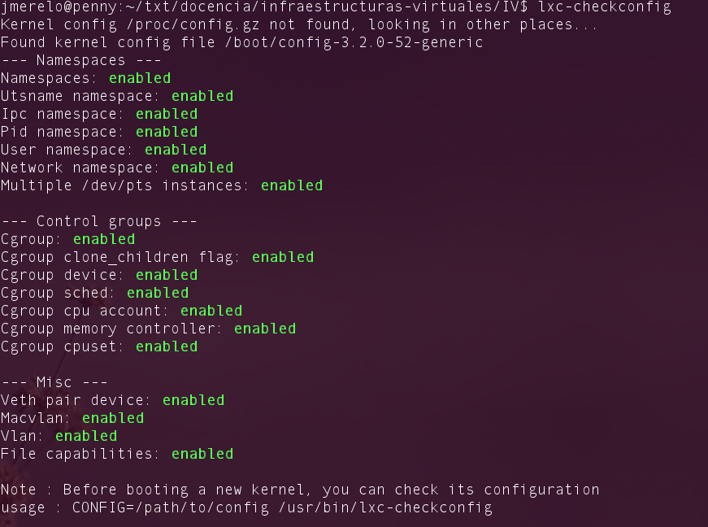
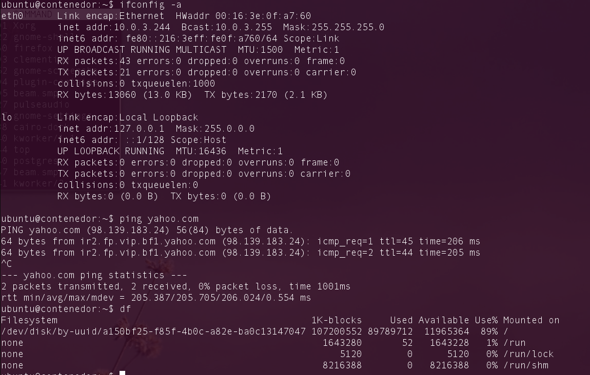
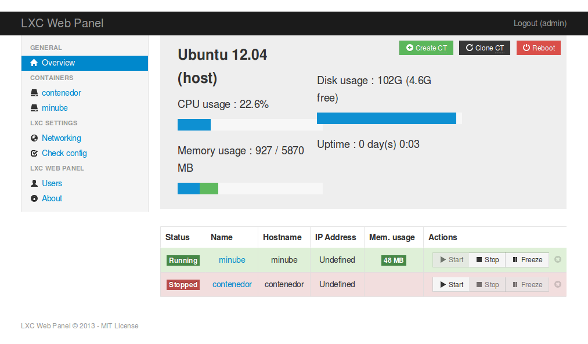

Virtualización *ligera* usando contenedores
===

<!--@
prev: Tecnicas_de_virtualizacion
next: Almacenamiento
-->

Objetivos
--

### Cubre los siguientes objetivos de la asignatura

* Conocer las diferentes tecnologías y herramientas de virtualización tanto para procesamiento, comunicación y almacenamiento. 
* Instalar, configurar, evaluar y optimizar las prestaciones de un servidor virtual.
* Configurar los diferentes dispositivos físicos para acceso a los
  servidores virtuales: acceso de usuarios, redes de comunicaciones o entrada/salida.
* Diseñar, implementar y construir un centro de procesamiento de datos virtual.
* Documentar y mantener una plataforma virtual.
* Optimizar aplicaciones sobre plataformas virtuales. 
* Conocer diferentes tecnologías relacionadas con la virtualización
  (Computación Nube, Utility Computing, Software as a Service) e
  implementaciones tales como Google AppSpot, OpenShift o Heroku.
* Realizar tareas de administración en infraestructura virtual.

### Objetivos específicos

1. Entender cómo las diferentes tecnologías de virtualización se integran en la creación de contenedores. 

2. Crear infraestructuras virtuales completas.

3. Comprender los pasos necesarios para la configuración automática de las mismas.

Un  paso más hacia la virtualización completa: *contenedores*
-------

El aislamiento de grupos de procesos formando una *jaula* o
*contenedor* ha sido una característica de ciertos sistemas operativos
de la rama Unix desde los años 80, en forma del programa
[chroot](http://es.wikipedia.org/wiki/Chroot) (creado por Bill Joy, el
que más adelante sería uno de los padres de Java). La restricción de
uso de recursos de las *jaulas `chroot`*, que ya hemos visto, se limitaba a la protección
del acceso a ciertos recursos del sistema de archivos, aunque son
relativamente fáciles de superar; incluso así, fue durante mucho
tiempo la forma principal de configurar servidores de alojamiento
compartidos y sigue siendo una forma simple de crear virtualizaciones *ligeras*. Las
[jaulas BSD](http://en.wikipedia.org/wiki/FreeBSD_jail) constituían un
sistema más avanzado, implementando una
[virtualización a nivel de sistema operativo](http://en.wikipedia.org/wiki/Operating_system-level_virtualization)
que creaba un entorno virtual prácticamente indistinguible de una
máquina real (o máquina virtual real). Estas *jaulas* no sólo impiden
el acceso a ciertas partes del sistema de ficheros, sino que también
restringían lo que los procesos podían hacer en relación con el resto
del sistema. Tiene como limitación, sin embargo, la obligación de
ejecutar la misma versión del núcleo del sistema.

En
[esta presentación](http://www.slideshare.net/dotCloud/scale11x-lxc-talk-16766275)
explica como los espacios de nombres son la clave para la creación de
contenedores y cuáles son sus ventajas frente a otros métodos de
virtualización

El mundo Linux no tendría capacidades similares hasta bien entrados los años 90, con
[vServers, OpenVZ y finalmente LXC](http://en.wikipedia.org/wiki/Operating_system-level_virtualization#Implementations). Este
último, [LXC](http://lxc.sourceforge.net), se basa en el concepto de
[grupos de control o CGROUPS](http://en.wikipedia.org/wiki/Cgroups),
una capacidad del núcleo de Linux desde la versión 2.6.24 que crea
*contenedores* de procesos unificando diferentes capacidades del
sistema operativo que incluyen acceso a recursos, prioridades y
control de los procesos. Los procesos dentro de un contenedor están
*aislados* de forma que sólo pueden *ver* los procesos dentro del
mismo, creando un entorno mucho más seguro que las anteriores
*jaulas*. Estos [CGROUPS han sido ya vistos en el tema anterior](Intro:concepto_y_soporte_fisico.md). 

Dentro de la familia de sistemas operativos Solaris (cuya última
versión libre se denomina
[illumos](http://en.wikipedia.org/wiki/Illumos), y tiene también otras
versiones como SmartOS) la tecnología
correspondiente se denomina
[zonas](http://en.wikipedia.org/wiki/Solaris_Zones). La principal
diferencia es el bajo *overhead* que le añaden al sistema operativo y
el hecho de que se les puedan asignar recursos específicos; estas
diferencias son muy leves al tratarse simplemente de otra
implementación de virtualización a nivel de sistema operativo.

Un contenedor es, igual que una jaula, una forma *ligera* de virtualización, en el sentido
que no requiere un hipervisor para funcionar ni, en principio, ninguno
de los mecanismos hardware necesarios para llevar a cabo
virtualización. Tiene la limitación de que la *máquina invitada* debe
tener el mismo kernel y misma CPU que la máquina anfitriona, pero si
esto no es un problema, puede resultar una alternativa útil y ligera a
la misma. A diferencia de las jaulas, combina restricciones en el
acceso al sistema de ficheros con otras restricciones aprovechando
espacios de nomgres y grupos de control. `lxc` es la solución de
creación de contenedores más fácil de usar hoy en día en Linux.

Instala LXC en tu versión de Linux favorita. Normalmente la versión en desarrollo, disponible tanto en [GitHub](http://github.com/lxc/lxc) como en el [sitio web](http://linxcontainers.com) está bastante más avanzada; para evitar problemas sobre todo con las herramientas que vamos a ver más adelante, conviene que te instales la última versión y si es posible una igual o mayor a la 1.0.

Esta virtualización *ligera* tiene, entre otras ventajas, una
*huella* escasa: un ordenador normal puede admitir 10 veces más contenedores
(o *tápers*) que máquinas virtuales; su tiempo de arranque es de unos
segundos y, además, tienes mayor control desde fuera (desde el anfitrión) del que se pueda
tener usando máquinas virtuales. 

Usando `lxc`
--

No todos los núcleos del sistema operativo pueden usar este tipo de container; para empezar,
dependerá de cómo esté compilado, pero también del soporte que tenga
el hardware. `lxc-checkconfig` permite comprobar si está preparado
para usar este tipo de tecnología y también si se ha configurado correctamente. Parte de la configuración se
refiere a la instalación de `cgroups`, que hemos visto antes; el resto
a los espacios de nombres y a capacidades *misceláneas* relacionadas
con la red y el sistema de ficheros. 

Hay que tener en cuenta que si no aparece alguno de esas capacidades
como activada, LXC no va a funcionar. Pero si no hay ningún problema y
todas están *enabled* se puede
[usar lxc con relativa facilidad](http://www.stgraber.org/2012/05/04/lxc-in-ubuntu-12-04-lts/)
siempre que tengamos una distro como Ubuntu relativamente moderna:

	sudo lxc-create -t ubuntu -n una-caja
	
crea un contenedor denominado `una-caja` e instala Ubuntu en él. Esto
tardará un rato mientras se bajan una serie de paquetes y se
instalan. O se
puede usar una imagen similar a la que se usa en
[EC2 de Amazon](http://aws.amazon.com/es/ec2/):

	sudo lxc-create -t ubuntu-cloud -n nubecilla

que funciona de forma ligeramente diferente, porque se descarga un
fichero `.tar.gz` usando `wget` (y tarda también un rato). Podemos
listar los contenedores que tenemos disponibles con `lxc-list`, aunque
en este momento cualquier contenedor debería estar en estado
`STOPPED`.

Para arrancar el contenedor y conectarse a él, 

	sudo lxc-start -n nubecilla
	
Dependiendo del contenedor que se arranque, habrá una configuración
inicial; en este caso, se configuran una serie de cosas y
eventualmente sale el login, que será para todas las máquinas creadas
de esta forma `ubuntu` (también clave). Lo que hace esta orden es
automatizar una serie de tareas tales como asignar los CGROUPS, crear
los namespaces que sean necesarios, y crear un puente de red tal como
hemos visto anteriormente. En general, creará un puente llamado
`lxcbr0` y otro con el prefijo `veth`. 

Comprobar qué interfaces puente se han creado y explicarlos.

Una vez arrancados los
contenedores, si se lista desde fuera aparecerá de esta forma:

	jmerelo@penny:~/txt/docencia/infraestructuras-virtuales/IV/documentos$ sudo lxc-list
	RUNNING
		contenedor
		nubecilla

	FROZEN

	STOPPED
	
Y, dentro de la misma, tendremos una máquina virtual con estas
apariencias:

Para el usuario del contenedor aparecerá exactamente igual que
cualquier otro ordenador: será una máquina virtual que, salvo error o
brecha de seguridad, no tendrá acceso al anfitrión, que sí podrá tener
acceso a los mismos y pararlos cuando le resulte conveniente. 

	sudo lxc-stop -n nubecilla
	
Las
[órdenes que incluye el paquete](https://help.ubuntu.com/lts/serverguide/lxc.html#lxc-admin)
permiten administrar las máquinas virtuales, actualizarlas y explican
cómo usar otras plantillas de las suministardas para crear
contenedores con otro tipo de sistemas, sean o no debianitas. Se
pueden crear sistemas basados en Fedora; también clonar contenedores
existentes para que vaya todo rápidamente. 

1. Crear y ejecutar un contenedor basado en Debian.

2. Crear y ejecutar un contenedor basado en otra distribución, tal
como Fedora. *Nota* En general, crear un contenedor basado en *tu*
distribución y otro basado en otra que no sea la tuya.  Fedora, al
parecer, tiene problemas si estás en Ubuntu 13.04 o superior, así que
en tal caso usa cualquier otra distro. Por ejemplo,
[Óscar Zafra ha logrado instalar Gentoo usando un script descargado desde su sitio, como indica en este comentario en el issue](https://github.com/IV-GII/GII-2013/issues/87#issuecomment-28639976). 

Los contenedores son la implementación de todas las tecnologías vistas
anteriormente: espacios de nombres, CGroups y puentes de red y como
tales pueden ser configurados para usar sólo una cantidad determinada
de recursos, por ejemplo
[la CPU](http://www.slideshare.net/dotCloud/scale11x-lxc-talk-16766275). Para
ello se usan los ficheros de configuración de cada una de las máquinas
virtuales. Sin embargo, tanto para controlar como para visualizar los
tápers (que así vamos a llamar a los contenedores a partir de ahora)
es más fácil usar [lxc-webpanel](http://lxc-webpanel.github.io/), un
centro de control por web que permite iniciar y parar las máquinas
virtuales, aparte de controlar los recursos asignados a cada una de
ellas y visualizarlos, tal como se muestra a continuación.

La página principal te da una visión general de los contenedores
instalados y desde ella se pueden arrancar o parar. 

1. Instalar `lxc-webpanel` y usarlo para arrancar, parar y visualizar las
máquinas virtuales que se tengan instaladas.

2. Desde el panel restringir los recursos que pueden usar: CPU
*shares*, CPUs que se pueden usar (en sistemas multinúcleo) o cantidad
de memoria.

Cada solución de virtualización tiene sus ventajas e
inconvenientes. La principal ventaja de los contenedores son el
aislamiento de recursos y la posibilidad de manejarlos, lo que hace
que se use de forma habitual en proveedores de infraestructuras
virtuales. El hecho de que se virtualicen los recursos también implica
que haya una diferencia en las prestaciones, que puede ser apreciable
en ciertas circunstancias.

1. Comparar las prestaciones de un servidor web en una jaula y el
mismo servidor en un contenedor. Usar nginx.

Configurando las aplicaciones en un táper
----

Una vez creados los tápers, son en casi todos los aspectos como una
instalación normal de un sistema operativo: se puede instalar lo que
uno quiera. Sin embargo, una de las ventajas de la infraestructura
virtual es precisamente la (aparente) configuración del *hardware*
mediante *software*: de la misma forma que se crea, inicia y para
desde el anfitrión una MV, se puede configurar para que ejecute unos
servicios y programas determinados.

A este tipo de aplicaciones y sistemas se les denomina
[SCM por *software configuration management*](http://en.wikipedia.org/wiki/Software_configuration_management);
a pesar de ese nombre, se dedican principalmente a configurar
hardware, no software. Un sistema de este estilo permite, por ejemplo,
crear un táper (o, para el caso, una máquina virtual, o muchas de
ellas) y automáticamente *provisionarla* con el software necesario
para comportarse como un
[PaaS](http://jj.github.io/IV/documentos/temas/Intro:concepto_y_soporte_fisico#usando_un_servicio_paas)
o simplemente como una máquina de servicio al cliente. 

En general, un SCM permite crear métodos para instalar una aplicación
o servicio determinado, expresando sus dependencias, los servicios que
provee y cómo se puede trabajar con ellos. Por ejemplo, una base de
datos ofrece precisamente ese servicio; un sistema de gestión de
contenidos dependerá del lenguaje en el que esté escrito; además, se
pueden establecer *relaciones* entre ellos para que el CMS use la BD
para almacenar sus tablas. 

Hay
[decenas de sistemas CMS](http://en.wikipedia.org/wiki/Comparison_of_open-source_configuration_management_software),
aunque hoy en día los hay que tienen cierta popularidad, como Salt,
Ansible, Chef, Juju y Puppet. Todos ellos tienen sus ventajas e
inconvenientes, pero para la configuración de tápers se puede usar
directamente [Juju](http://juju.ubuntu.com), creado por Canonical
especialmente para máquinas virtuales de ubuntu que se ejecuten en la
nube de Amazon. En este punto nos interesa también porque se puede
usar directamente con contenedores LXC, mientras que no todos lo
hacen.

Para instalarlo conviene usar la última versión; la que hay en los
repositorios de algunas versiones de Ubuntu no tiene todas las
capacidades. Por tanto:

	sudo add-apt-repository ppa:juju/stable
	sudo apt-get update && sudo apt-get install juju-core
	
Si has instalado previamente con sudo apt-get install juju te lo
desinstalará automáticamente. Esto añade un repositorio PPA (creado
por el desarrollador); actualiza los contenidos del local e instala
`juju`, que está basado en Python y por tanto instalará un montón de
librerías del mismo, inclusive Twisted y varias más. 

Para empezar a trabajar con él, se escribe

	juju init

Esta orden escribe en el subdirectorio `~/.juju`, que también crea, el
fichero `environments.yaml`, que contiene información sobre los
*entornos* con los que suele trabajar: proveedores de servicios de
nube y el local, que es el que vamos a probar. Por omisión, el fichero
trabajará con Amazon EC2. Tenemos que cambiarlo a `local` [si queremos
trabajar con contenedores LXC](https://juju.ubuntu.com/docs/config-local.html) editando el
fichero y cambiando la línea 
	
	#default: amazon
	
comentándola de esta forma, por ejemplo, y añadiendo 

	default: local

Este es el entorno con el que se va a trabajar por omisión; usando

	juju switch amazon
	
por ejemplo, se puede cambiar a ese entorno. 

Para [trabajar en local hace falta instalar MongoDB](http://marcoceppi.com/2013/07/compiling-juju-and-the-local-provider/). Si no lo tienes
instalado, haz

	sudo apt-get install mongodb-server
	
MongoDB reserva una gran cantidad de espacio para sus bases de datos, por lo que tendrás que tener bastantes gigas libres para usarlo. 
	

Si tienes ya algún táper creado, te fastidias. A `juju`,
aparentemente, le gustan los suyos propios. Pero la verdad es que es
fácil crearlo, simplemente

	juju bootstrap
	
te creará un táper con su propia configuración, algo así como 

	bash$ lxc-ls 
	
	contenedor  jmerelo-local-machine-1  jmerelo-local-machine-2
	nubecilla
	
Es decir, `usuario-machine-número`. A estas alturas no tengo muy claro
como se puede entrar a través de lxc, pero usando `juju` se puede
hacer fácilmente. Lo vemos más adelante.

A partir de la creación de este táper, se pueden instalar
cosas. `juju` usa [*encantos*](https://jujucharms.com/), scripts que expresan qué necesitan y qué
provee cada aplicación. Son simplemente *scripts* que usan un lenguaje
basado en YAML, pero ya hay *charms* para las tareas más comunes:
instalar servicios web o lenguajes de programación. Por ejemplo, para
instalar mediawiki simplemente se escribiría 

	juju deploy mediawiki
	
No hace falta que indiquemos la máquina en principio, porque en todo
momento se trabaja con la máquina por defecto (en mi caso
`jmerelo-machine-1`). Lo que ocurre es que con esto no se consigue
gran cosa. Mediawiki usa mysql, por lo que habrá que instalarlo
también

	juju deploy mysql
	
No sólo eso, sino que habrá que indicar que mediawiki va a usar
precisamente mysql como base de datos. Se trata de añadir [una
*relación*](https://juju.ubuntu.com/docs/charms-relations.html) con 

	juju add-relation mediawiki mysql
	
Una vez hecho esto, se tiene que
[exponer](https://juju.ubuntu.com/docs/charms-exposing.html) el
servicio para que pueda ser usado por el público, lo que implicará que
se enganche al servidor web, por ejemplo

	juju expose mediawiki
	
Con esto se puede mostar ya el estado de la máquina:

	juju status

que mostrará algo así:

	machines:
	"0":
    agent-state: started
    agent-version: 1.12.0.1
    instance-id: localhost
    instance-state: missing
    series: precise
	"1":
    agent-state: started
    agent-version: 1.12.0.1
    instance-id: jmerelo-local-machine-1
    instance-state: missing
    series: precise
	"2":
    agent-state: started
    agent-version: 1.12.0.1
    instance-id: jmerelo-local-machine-2
    instance-state: missing
    series: precise
	services:
	mysql:
    charm: cs:precise/mysql-27
    exposed: false
    relations:
    cluster:
    - mysql
    db:
    - wordpress
    units:
    mysql/0:
    agent-state: started
    agent-version: 1.12.0.1
    machine: "1"
    public-address: 10.0.3.15
	wordpress:
    charm: cs:precise/wordpress-16
    exposed: true
    relations:
    db:
    - mysql
    loadbalancer:
    - wordpress
    units:
    wordpress/0:
    agent-state: started
    agent-version: 1.12.0.1
    machine: "2"
    public-address: 10.0.3.23

`0` es la máquina anfitriona; en este caso muestro un ejemplo en el
que se ha instalado wordpress; en el mismo se muestra la relación con
la base de datos y también con un *loadbalancer* para equilibrar la
carga. Como dato interesante, esta orden nos da la IP local del táper
que hemos creado, por lo que accediendo desde el navegador a
http://10.0.3.15 nos mostrará la página de inicio de MediaWiki. Al instalar un *servicio* en una *máquina* se crean una serie de *unidades*. Esas unidades son como mini-contenedores que están a cargo de ejecutar el servicio que se ha instalado mediante juju. 

1. Instalar `juju`.

2. Usándolo, instalar `MySQL` en un táper. 

Para desmontar los servicios se tiene que hacer en orden inverso a su creación: primero hay que destruir las unidades, de esta forma: 

	sudo juju destroy-unit mysql/0

La destrucción de las máquinas sólo se puede hacer una vez que todas las unidades hayan dejado de funcionar, de esta forma:

	sudo juju destroy-machine 2
	
donde 2 es el número de la máquina que aparecería en status. La máquina `0` siempre es la máquina anfitriona, que no se puede destruir a no ser que queramos ver el fin del universo conocido. 

Los números de máquina no se reutilizan, y cuando se ejecuta 

	sudo juju add-machine
	
se creará una con número posterior al último utilizado:

	environment: local
  machines:
    "0":
      agent-state: started
      agent-version: 1.16.3.1
      dns-name: 10.0.3.1
      instance-id: localhost
      series: precise
    "4":
      instance-id: pending
      series: precise

La nueva máquina aparecerá inicialmente de esta forma, porque la orden regresa antes de que se complete la orden. Posteriormente, si todo ha ido bien, aparecerá el estado completo de esta nueva máquina. Si ha ido mal, aparecerá algo como:

	 agent-state-info: '(error: error executing "lxc-create": No such file or directory
      - bad template: ubuntu-cloud; bad template: ubuntu-cloud)'
    instance-id: pending
    series: precise

Cuando algo va mal en `juju`, hay que echar mano de los logs. En algún momento funcionará `juju debug-log`, pero por lo pronto hay que apañarse con el registro de errores del mismo, que se puede consultar (y se debe borrar con cierta frecuencia, porque engorda que da gusto), en `~/.juju/local/log/machine-0.log`; en este caso sería el de la máquina anfitriona, pero cada una de las máquinas tendrá su propio registro. 

	2013-11-21 21:28:16 DEBUG juju.rpc.jsoncodec codec.go:107 <- {"RequestId":110,"Type":"Provisioner","Request":"SetStatus","Params":{"Entities":[{"Tag":"machine-4","Status":"error","Info":"error executing \"lxc-create\": No such file or directory - bad template: ubuntu-cloud; bad template: ubuntu-cloud","Data":null}],"Machines":null}}
	
	Lo que indica que falta una plantilla del tipo de máquina que se
	ha usado, por algún error en la instalación de `lxc-templates`,
	seguramente. 
	
	

1. Destruir toda la configuración creada anteriormente
2. Volver a crear la máquina anterior y añadirle mediawiki y una
relación entre ellos.
3. Crear un script en shell para reproducir la configuración usada en
las máquinas que hagan falta.

Breve introducción a los hipervisores
-----

Un [hipervisor](http://en.wikipedia.org/wiki/Hypervisor) es un monitor
de máquinas virtuales que permite instalarlas, activarlas, monitorizar
su actividad e interaccionar con ellas de las formas posibles. Un
hipervisor se denomina
[*bare-metal*](http://en.wikipedia.org/wiki/Bare_machine) o Tipo uno
si se ejecuta *antes* que el sistema operativo (siendo, por tanto, un
sistema operativo en sí) o Tipo 2 si se arranca como una aplicación
del sistema operativo; VirtualBox sería un ejemplo de este último.

Un hipervisor denomina *dominios* a las máquinas virtuales con las que
trabaja, siendo él mismo también un dominio denominado [*dominio
0*](http://wiki.xen.org/wiki/Dom0). Las MVs alojadas son *dominios de usuario* o *DomU*.

Usando los hipervisores de forma uniforme
---

Estos contenedores se pueden manejar junto con otros proveedores de
infraestructuras virtuales (en general, hipervisores, aunque algunos como User Mode Linux pueden no serlo) usando herramientas como la librería
[libvirt](http://en.wikipedia.org/wiki/Libvirt), que abstrae las
características generales de todos ellos y permite trabajar, usando
*drivers* específicos, con todo tipo de contenedor o máquina
virtual. `libvirt` es un interfaz de aplicación a los diferentes
hipervisores y gestores de contenedores que pueda haber en un
ordenador, y se puede usar tanto desde el interfaz de la línea de
órdenes como conectando con un servicio directamente desde una
aplicación. 

Instalar `libvirt`. Te puede ayudar
[esta guía para Ubuntu](https://help.ubuntu.com/12.04/serverguide/libvirt.html). 

`libvirt` ofrece un interfaz de aplicación usable desde un programa,
pero también un *shell*, `virsh`, para gestión desde línea de
órdenes. Si tienes hipervisores instalados, puedes usar `libvirt`
directamente, pero si tienes sólo los contenedores anteriores, tendrás
que usar el [driver para `lxc`](http://libvirt.org/drvlxc.html). Lo
que permite `libvirt` es independizar la gestión de las máquinas
virtuales de la implementación física de las mismas: desde un
contenedor hasta una máquina virtual usando diferentes
hipervisores. Con las diferentes herramientas, se pueden instalar,
clonar, arrancar y conectarse a las diferentes máquinas virtuales o
gestionar las existentes.

En
[este mensaje a la lista de correo de libvirt](https://lists.linux-foundation.org/pipermail/containers/2008-September/013237.html)
explica como usarlo para crear rápidamente un contenedor con el mismo
y gestionarlo desde `virsh`.

Se pueden usar máquinas virtuales ya instaladas, pero facilita mucho
la labor posterior
[instalarlas directamente con `virt-install`](https://fedoraproject.org/wiki/Getting_started_with_virtualization#Creating_a_guest_with_virt-install). Esta
orden usará los drivers instalados para crear un contenedor y
colocarlo bajo el control de `libvirt`.

Instalar un contenedor usando `virt-install`.

De hecho, también se pueden usar contenedores que hayan sido instalados usando `lxc` (como no podía ser de otra forma, por otro lado). Por [ejemplo](http://wiki.centos.org/HowTos/LXC-on-CentOS6), esta orden 

    virt-install --connect lxc:/// --name esa_maquina --ram 512 --vcpu 1 --filesystem /var/lib/libvirt/lxc/taper --noautoconsole
	
instalaría usando el conector para lxc	una máquina con el nombre indicado, medio giga de RAM, una sola CPU virtual y un filesystem ya instalado previamente en el subdirectorio `taper`. 

Una vez instalados diferentes contenedores, `virsh` permite trabajar
con ellos

Gestión de contenedores con `docker`
---

[Docker](http://docker.io) es una herramienta de gestión de
contenedores que permite no sólo instalarlos, sino trabajar con el
conjunto de ellos instalados (orquestación) y exportarlos de forma que
se puedan usar en diferentes instalaciones. La tecnología de
[Docker](http://en.wikipedia.org/wiki/Docker_%28software%29) es
relativamente reciente, habiendo sido publicado en marzo de 2013;
actualmente está sufriendo una gran expansión, sobre todo por su uso
dentro de [CoreOS](http://coreos.com/), un sistema operativo básico
basado en Linux para despliegue masivo de servidores.

Por lo pronto,
[instalar `docker` es fácil, pero no directo](https://www.docker.io/gettingstarted/#h_installation). Por
ejemplo, para
[Ubuntu hay que dar de alta una serie de repositorios](http://docs.docker.io/en/latest/installation/ubuntulinux/)
y no funcionará con versiones más antiguas de la 12.04 (y en este caso
sólo si se instalan kernels posteriores).

Instalar docker.

`docker` permite instalar contenedores y trabajar con
ellos. Normalmente el ciclo de vida de un contenedor pasa por su
creación y, más adelante, ejecución de algún tipo de programa, por
ejemplo de instalación de los servicios que queramos; luego se puede
salvar el estado del táper y clonarlo o realizar cualquier otro tipo
de tareas. 

Así que comencemos desde el principio:
[vamos a ejecutar `docker`y trabajar con el contenedor creado](http://docs.docker.io/en/latest/installation/ubuntulinux/).

Primero, se ejecuta como un servicio

	sudo docker -d &
	
La línea de órdenes de docker conectará con este daemon, que mantendrá
el estado de docker y demás. Cada una de las órdenes se ejecutará
también como superusuario, al tener que contactar con este *daemon*
usando un socket protegido.

A partir de ahí, podemos crear un contenedor

	sudo docker pull ubuntu
	
Esta orden descarga un contenedor básico de ubuntu y lo instala. Hay
muchas imágenes creadas y se pueden crear y compartir en el sitio web
de Docker, al estilo de las librerías de Python o los paquetes
Debian. Se pueden
[buscar todas las imágenes de un tipo determinado, como Ubuntu](https://index.docker.io/search?q=ubuntu)
o
[buscar las imágenes más populares](https://index.docker.io/most_stars). Estas
imágenes contienen no sólo sistemas operativos *bare bones*, sino
también otros con una funcionalidad determinada. 

1. Instalar a partir de docker una imagen alternativa de Ubuntu y alguna
adicional, por ejemplo de CentOS.

2. Buscar e instalar una imagen que incluya MongoDB.

El contenedor tarda un poco en instalarse, mientras se baja o no la
imagen. Una vez bajada, se pueden empezar a ejecutar comandos. Lo
bueno de `docker` es que permite ejecutarlos directamente sin
necesidad de conectarse a la máquina; la gestión de la conexión y
demás lo hace ello, al modo de Vagrant (lo que veremos más adelante).

Podemos ejecutar, por ejemplo, un listado de los directorios

	sudo docker run ubuntu ls
	
Tras el sudo, hace falta docker; `run` es el comando de docker que
estamos usando, `ubuntu` es el id de la máquina y finalmente `ls`el
comando que estamos ejecutando.

La máquina instalada la podemos usar con el nombre del SO, pero cada
táper tiene un id único que se puede ver con 

	sudo docker ps -a=false
	
Obteniendo algo así:

	CONTAINER ID        IMAGE               COMMAND             CREATED             STATUS              PORTS               NAMES
b76f70b6c5ce        ubuntu:12.04        /bin/bash           About an hour ago   Up About an hour                        sharp_brattain     

El primer número es el ID de la máquina que podemos usar también para
referirnos a ella en otros comandos. También se puede usar 
	
	sudo docker images
	
Que devolverá algo así:

	REPOSITORY          TAG                 IMAGE ID            CREATED             VIRTUAL SIZE
ubuntu              12.04               8dbd9e392a96        9 months ago        128 MB
ubuntu              latest              8dbd9e392a96        9 months ago        128 MB
ubuntu              precise             8dbd9e392a96        9 months ago        128 MB
ubuntu              12.10               b750fe79269d        9 months ago        175.3 MB
ubuntu              quantal             b750fe79269d        9 months ago        175.3 MB

El *IMAGE ID* es el ID interno del contenedor, que se puede usar para
trabajar en una u otra máquina igual que antes hemos usado el nombre
de la imagen:

		sudo docker run b750fe79269d du
		
En vez de ejecutar las cosas una a una podemos directamente [ejecutar
un shell](http://docs.docker.io/en/latest/use/basics/):

	sudo docker run -i -t ubuntu /bin/bash

que [indica](http://docs.docker.io/en/latest/commandline/cli/#run) que
se está creando un seudo-terminal (`-t`) y se está ejecutando el
comando interactivamente (`-i`). A partir de ahí sale la línea de
órdenes, con privilegios de superusuario, y podemos trabajar con la
máquina e instalar lo que se nos ocurra.

Crear un usuario propio e instalar nginx en el contenedor creado de
esta forma.

Los contenedores se pueden arrancar de forma independiente con `start`

	sudo docker start	ed747e1b64506ac40e585ba9412592b00719778fd1dc55dc9bc388bb22a943a8
	
pero hay que usar el ID largo que se obtiene dando la orden de esta
forma

	sudo docker images -notrunc

Para entrar en ese contenedor tienes que averiguar qué IP está usando
y los usuarios y claves y por supuesto tener ejecutándose un cliente
de `ssh` en la misma. Para averiguar la IP:

	sudo docker inspect	ed747e1b64506ac40e585ba9412592b00719778fd1dc55dc9bc388bb22a943a8
	
te dirá toda la información sobre la misma, incluyendo qué es lo que
está haciendo en un momento determinado. Para finalizar, se puede
parar usando `stop`. 

Hasta ahora el uso de docker [no es muy diferente del contenedor, pero
lo interesante](http://stackoverflow.com/questions/17989306/what-does-docker-add-to-just-plain-lxc) es que se puede guardar el estado de un contenedor tal
como está usando [commit](http://docs.docker.io/en/latest/commandline/cli/#commit)

	sudo docker commit 8dbd9e392a964056420e5d58ca5cc376ef18e2de93b5cc90e868a1bbc8318c1c nuevo-nombre

que guadará el estado del contenedor tal como está en ese
momento. Este `commit` es equivalente al que se hace en un
repositorio; para enviarlo al repositorio habrá que usar `push` (pero
sólo si uno se ha dado de alta antes).

Crear a partir del contenedor anterior una imagen persistente con
commit. 

Finalmente, `docker` tiene capacidades de provisionamiento similares a
otros [sistemas (tales como Vagrant, que se verá más adelante](Gestion_de_configuraciones.md) usando
[*Dockerfiles*](http://docs.docker.io/en/latest/use/builder/). Por
ejemplo, [se
puede crear fácilmente un Dockerfile para instalar node.js con el
módulo express](http://docs.docker.io/en/latest/examples/nodejs_web_app/). 

Crear una imagen con las herramientas necesarias para DAI sobre un
sistema operativo de tu elección. 

	
A dónde ir desde aquí
-----

En el [siguiente tema](Almacenamiento) veremos cómo crear y configurar el
almacenamiento virtual que, en general, es independiente de la
generación de una máquina virtual. También puedes ir directamente al
[tema de uso de sistemas](Uso_de_sistemas.md) en el que se trabajará
con sistemas de virtualización completa. 
	
