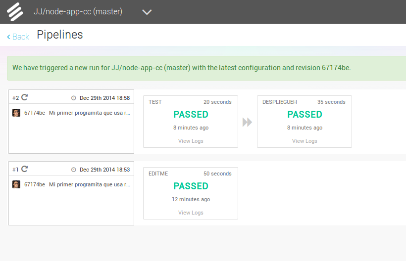

# Desplegando aplicaciones en la nube: Uso de PaaS

<!--@
prev: Microservicios
next: Contenedores
-->

<div class="objetivos" markdown="1">

## Objetivos

### Cubre los siguientes objetivos de la asignatura

1. Conocer los conceptos relacionados con el proceso de virtualización
   tanto de software como de hardware y ponerlos en práctica.

2. Justificar la necesidad de procesamiento virtual frente a real en
   el contexto de una infraestructura TIC de una organización.

### Objetivos específicos

1. Comprender los conceptos necesarios para trabajar con diferentes
   plataformas PaaS

2. Aplicar el concepto de *DevOps* a este tipo específico de plataforma.

3. Aplicar el sistema de control de fuentes `git` para despliegue de
   aplicaciones en la nube.

</div>

## Introducción

> Esta [presentación](https://jj.github.io/pispaas/#/) es un resumen del
> concepto de Plataforma como Servicio (PaaS) y alguna cosa adicional que no
> está incluida en este tema pero que conviene conocer de todas formas.

Cuando uno quiere desplegar una aplicación sobre una infraestructura ya
definida y que no va a cambiar, teniendo parte del trabajo de instalación ya
hecho, o al menos preparado para hacerse con la pulsación de un botón, a la vez
que tiene flexibilidad para trabajar con marcos de aplicaciones más allá de lo
que ofrece programar *plugins* (como en el *SaaS*), necesita un
[*Platform as a Service* o PaaS](https://en.wikipedia.org/wiki/Platform_as_a_service).
Un PaaS proporciona una *pila*, es decir, varias capas de servicios apilados de
forma que cada uno usa al siguiente, que incluye, generalmente, almacenamiento
de datos, un marco concreto para trabajar (tal como Django o Ruby on Rails) y,
adicionalmente, un servidor web.

El elegir un PaaS conlleva una cierta falta de flexibilidad: se pueden usar las
pilas que proporciona en servicio y el usuario solo puede subir su aplicación
que las use, no instalar elementos adicionales que necesiten permisos de
superusuario. Pero, por otro lado, ofrece la comodidad de tener que
concentrarse solo en la aplicación en sí y no en la infraestructura si se trata
de una aplicación que use los marcos más comunes. Es, por eso, menos *DevOps*
que una solución *IaaS*, pero por otro lado también tiene una parte que es la
configuración y despliegue de la aplicación en sí y los tests que se vayan a
usar. Hay que tener en cuenta que, en general, la definición de la
infraestructura depende del PaaS que se use y por eso es bastante menos
portable que usar un IaaS. Sin embargo, para un microservicio específico, o
para una parte de la aplicación que sea invariable, puede ser bastante útil y
conveniente.

## Usando un servicio PaaS

La mayoría de los servicios PaaS están ligados a una *pila* de
soluciones determinada o a un vendedor determinado, es decir, a una
serie de aplicaciones que trabajan unas sobre otras cada una usando el
servicio de la anterior. Han surgido
muchos, por ejemplo, en torno a [node.js](https://nodejs.org), un
intérprete de JavaScript asíncrono que permite crear fácilmente
aplicaciones REST.

> Pila que se ha venido en
> llamar [MEAN](https://en.wikipedia.org/wiki/MEAN_(software_bundle)) e incluye
> también Mongo y Express.

Algunos servicios PaaS son específicos (solo alojan una solución determinada,
como [CloudAnt](https://www.ibm.com/cloud/cloudant) que aloja una base de datos
con CouchDB o genéricos), permitiendo una serie de soluciones en general
relativamente limitada; [Heroku](https://www.heroku.com) y
[OpenShift](https://www.openshift.com) están entre estos últimos, pero también
[hay otros](https://www.codediesel.com/nodejs/5-paas-solutions-to-host-your-nodejs-apps/),
dependiendo del tipo de pila que quieras alojar; los tres anteriores son los
que trabajan bien con node.js, [igual que platform.sh](https://platform.sh/) o
[IBM BlueMix](https://console.bluemix.net/) (que ofrece un período de prueba
gratuito, que no se puede renovar, lo sé por experiencia).

> Después de probar casi todos los servicios anteriores, me da la impresión de
> que poco hay más allá de Heroku y Openshift. AppFog, después de la
> efervescencia inicial, dan 30 días de prueba solamente. nitrous.io también da
> un periodo de prueba y se puede usar como IaaS, pero del resto, al menos los
> que funcionan con node.js, poco más hay.

[AppAgile](https://cloud.telekom.de/en/infrastructure/appagile-paas-big-data/paas)
trabaja con Perl, por ejemplo, como lo hacía Stackato y otras. En general, si
necesitas otros lenguajes, tendrás que buscar porque la oferta variará. Los más
fiables son OpenShift y Heroku, y los que ofrecen más opciones a la hora de
elegir lenguajes.

<div class='ejercicios' markdown="1">

Darse de alta en algún servicio PaaS tal como Heroku
o [BlueMix](https://cloud.ibm.com/) o usar alguno de los PaaS de otros
servicios cloud en los que ya se esté dado de alta.

</div>

Estos servicios proveen un número limitado de máquinas virtuales y
siguen en general un modelo *freemium*: capacidades básicas son
gratuitas y para conseguir mayores prestaciones o un uso más
intensivo, o bien capacidades que no entren en el paquete básico, hay
que pasar al modelo de pago. Estas máquinas virtuales se denominan
[*dynos*](https://devcenter.heroku.com/articles/dynos) en Heroku y
simplemente aplicaciones en OpenShift, aunque los *dynos* son mucho
más flexibles que las aplicaciones de OpenShift.

Para trabajar con estas configuraciones, generalmente, los
PaaS proporcionan un *toolbelt* o herramientas de línea de órdenes que
permiten controlarlos directamente desde nuestra aplicación; estos
conjuntos de herramientas acceden a un API que también podemos
manipular en caso necesario. Tanto desde estas herramientas como desde
el panel de control, los PaaS permiten *escalar* fácilmente una
aplicación, añadiéndole nuevos *nodos* sin necesidad de modificar la
aplicación. El propio *middleware* del PaaS se encarga de equilibrar
la carga

> Aunque
> [no necesariamente lo hace de la mejor forma](https://genius.com/James-somers-herokus-ugly-secret-annotated).
> Heroku cambió el enrutado de forma que ya no funciona tan bien como lo hacía
> 5 años atrás.

entre los diferentes nodos que uno tenga. La ventaja es que te ofrece
un PaaS es que, aunque evidentemente haya que pagar por lo que se
consume, solo hay que hacerlo mientras se necesita; una vez pasado el
pico, se puede escalar *hacia abajo* eliminando los nodos que uno no
necesite; por supuesto, el propio PaaS suele proveer de herramientas
que hagan esto de forma más o menos automática.

La interacción con los PaaS se hace en general a través de una
herramienta de línea de órdenes que permite, para empezar, crear
fácilmente, a partir de una plantilla, una aplicación básica con las
características definidas; en ambos casos habrá que descargar una
aplicación libre para llevar a cabo ciertas tareas como monitorizar el
estatus y hacer tests básicos; una vez creado el fuente de la
aplicación el despliegue en la máquina virtual se hace mediante
`git` tal como hemos contado anteriormente.

Los lenguajes más habituales en las PaaS son los de scripting, que
permiten crear aplicaciones rápidamente; las bases de datos
disponibles son tanto las clásicas DBMS aunque, con más frecuencia, se
usan las bases de datos NoSQL como MongoDB, Redis o CouchDB.

En cualquier caso, los PaaS suelen tener un panel de control que
permite hacer ciertas cosas como configurar *plugins* o *add-ons*
desde la web fácilmente. Estos suelen seguir el mismo modelo *freemium*:
diferentes tamaños o instancias son gratuitas o tienen un coste; en
algunos casos cualquier instancia tiene un coste, y en algunas
plataformas, como Heroku, hay que introducir datos de facturación
(para cuando se excedan los límites gratuitos) en casi todos los
*add-ons*, lo que deja una cantidad limitada para uso de pruebas o
enseñanza.

<div class='ejercicios' markdown="1">

Crear una aplicación en OpenShift o en algún otro PaaS en el que se
haya dado uno de alta. Realizar un despliegue de prueba usando alguno
de los ejemplos incluidos con el PaaS.

</div>

>En todo caso, no está mal tener disponible una tarjeta de crédito,
>preferiblemente virtual o de prepago, para trabajar con todo tipo de
>infraestructuras de nube en pruebas; puedes acceder a muchos más
>servicios y posibilidades y, aunque se excedan los límites gratuitos,
>el coste no suele ser grande.

Los PaaS no dejan acceso completo a la máquina virtual que ejecuta
nuestra aplicación y, en muchos casos, tienen también otras
limitaciones. Por ejemplo, no dejan conectar por `ssh` o no tienen un
sistema de ficheros permanente, de forma que hay que usar de forma
forzosa un almacenamiento de datos que sea un *add-on* o bien otro
externo que se ofrezca de forma independiente (pero siguiendo el mismo
modelo). También hay que tener en cuenta que las prestaciones que
vamos a poder obtener de los *tier* gratuitos no van a ser como para
poder montar una *startup* y forrarnos: son muy limitadas, tanto en
latencia como en CPU como en memoria.

En general, el enfoque para este tipo de herramientas (y para casi
todo el desarrollo web moderno) es trabajar con servidores REST que
envíen al cliente algún tipo de información de la que este estará
encargado y plasmará. También eso facilita el desarrollo de cualquier
tipo de cliente, móvil, navegador o incluso middleware, que puede
estar incluido en la misma aplicación. Por eso haremos un pequeño
recorrido por el concepto de servicios REST, basados en los verbos del
protocolo HTTP.

<div class='nota' markdown='1'>

Este
[vídeo explica como usar `heroku` para aplicaciones en Ruby](https://www.youtube.com/watch?v=dqAXmratgzE);
en
[este un poco más extenso y hecho por una persona de Heroku](https://www.youtube.com/watch?v=VZgHItD9bAQ)
te explica cómo usarlo. No hay muchos vídeos en español, pero en
[este explica cómo crear una aplicación Django y subirla a Heroku](https://www.youtube.com/watch?v=3k2eg0stnCI)
y
[este es una introducción general con ejemplos de Ruby](https://www.youtube.com/watch?v=ii9G9JMvoXM).
En
[este otro encuentras cómo hacer un despliegue de Python y Flask en Heroku](https://www.youtube.com/watch?v=pmRT8QQLIqk).

</div>

## Creando un bot de Telegram para Heroku

Otro ejemplo de aplicación, usando en este caso Python 3.7, es un bot de
telegram. Un bot es un asistente, generalmente conversacional, que nos ayudará
en nuestras tareas del día a día. La aplicación de mensajería Telegram permite
obtener TOKENS para crear bots para su aplicación, y a lo largo de los años se
han creado librerías específicas para este fin, así que al final han aparecido
[muchos bots libres](https://github.com/python-telegram-bot/python-telegram-bot/wiki/Examples)
que pueden usarse de forma individual o en grupos. Irónicamente, para crear uno
de estos bots, lo primero que tenemos que hacer es hablar con un bot de
Telegram, [BotFather](https://telegram.me/botfather). Para ello, tenemos que
escribir en la conversación el comando `/newbot`, y tras responder a sus
preguntas para la configuración básica del nombre, nos devolverá un **token**.
Este token nos servirá para enlazar el código del bot a la aplicación de
Telegram. Una vez tenemos el **token**, nos toca ponernos manos a la obra con
el código del bot, que más tarde desplegaremos con Heroku. Para ello, usaremos
[una librería de python](https://python-telegram-bot.readthedocs.io/en/latest/index.html).
Como necesitaremos un Dockerfile y un `requirements` para luego desplegarlo en
condiciones, lo montaremos todo en un directorio para tenerlo ordenado.

```shell
mkdir mibot; cd mibot
```

Con nuestro editor de código favorito crearemos y editaremos un archivo
`bot.py` en esta carpeta. ¡Ojo! Vamos a usar **Python 3**, lo cual es
recomendable en general. Para empezar haremos un bot eco, que nos devuelva el
mismo mensaje que nosotros le hemos mandado. Observemos los imports:

```python
import logging
import os
import sys
from telegram.ext import Updater, CommandHandler, MessageHandler, Filters
```

Vamos a comentar un poco las librerías que hemos añadido. Las librerías `os` y
`sys` nos permiten manejar cuestiones básicas a bajo nivel, mientras que
`logging` nos permite guardar logs de la interacción con el bot y mostrarlos
por la terminal. Los módulos importados de `telegram.ext` nos permiten
manipular y enviar mensajes. Antes mencionábamos que se pueden guardar y
revisar logs. Vamos a activar esta opción:

```python
# Enabling logging
logging.basicConfig(level=logging.INFO,
                    format="%(asctime)s - %(name)s - %(levelname)s - %(message)s")
logger = logging.getLogger()
```

A continuación viene una parte importante. Es recomendable que algunas
variables delicadas las guardemos en el apartado _Settings_ de Heroku, en lugar
de ponerlas en plano en nuestro código. Por ello, para recuperarlas en la
ejecución usaremos:

```python
mode = os.getenv("MODE")
TOKEN = os.getenv("TOKEN")
```

Luego explicaremos dónde colocar esas variables. La primera nos permite ver el
modo de ejecución, en el ejemplo usaremos "dev" de developer, y TOKEN es el
**token** que no sha facilitado _BotFtaher_.

```python
if mode == "dev":
    def run(updater):
        updater.start_polling()
elif mode == "prod":
    def run(updater):
        PORT = int(os.environ.get("PORT", "8443"))
        HEROKU_APP_NAME = os.environ.get("HEROKU_APP_NAME")
        # Code from https://github.com/python-telegram-bot/python-telegram-bot/wiki/Webhooks#heroku
        updater.start_webhook(
            listen="0.0.0.0",
            port=PORT,
            url_path=TOKEN
        )
        updater.bot.set_webhook(
            "https://{}.herokuapp.com/{}".format(HEROKU_APP_NAME, TOKEN)
        )
else:
    logger.error("No MODE specified!")
    sys.exit(1)

```

De este modo podemos tener un adecuado control de la versión (desarrollo o
producción) de nuestro bot, y un mejor control de su seguridad. Bien, ahora
podemos pasar a definir los comandos. Como su nombre indica, esta función nos
va a permitir activar determinadas funciones de nuestro bot. La función de
inicio por defecto en la mayoría de los bots es `/start` que generalmente es un
saludo, ayuda o algo similar. Empecemos por ahí, pues.

```python
def start(update, context):
    logging.info("User started bot {}".format(update.message.from_user.first_name))
    context.bot.send_message(chat_id=update.message.chat_id, text="Hi there, {}".format(update.message.from_user.first_name))
    context.bot.send_message(chat_id=update.message.chat_id, text="What's up.")

```

Para darle algo de vidilla a nuestro bot, le he añadido una función especial,
un saludo personalizado. AL usar `update.message.from_user.first_name` nos
devuelve el nombre del usuario, de modo que el saludo (que se envía con
`context.bot.send_message`) queda mucho más personal. Como podemos comprobar,
el uso de mensajes funciona a través de los parámetros fundamentales: `update`
y `context`, que como sus nombres indican, van **actualizando** el
**contenido** de la conversación. Vale, ya tenemos el comando principal. Vamos
a crear ahora nuestra función especial, para hacernos eco.

```python
def echo(update, context):
    update.message.reply_text(update.message.text)

```

En esta ocasión lo único que hace es coger el mensaje del usuario
(`update.message.text`) y reenviarlo. Creemos ahora nuestro `main` para poder
poner todo en marcha una vez despleguemos el bot.

```python
if __name__ == '__main__':
    logger.info("Bot started")

    updater = Updater(token=TOKEN, use_context=True)

    # ADD dispatcher with command handler
    dispatcher = updater.dispatcher
    logger.info("working untill here")
    start_handler = CommandHandler('start', start)
    dispatcher.add_handler(start_handler)
    dispatcher.add_handler(MessageHandler(Filters.text, echo))
    logger.info(dispatcher.add_handler(start_handler))

run(updater)
```

Ahora es el momento de configurar los logs para ir viendo lo que ocurre en el
despliegue y ejecución de nuestro bot. Cada vez que usamos `logger.` estamos
guardando logs. Por otro lado, `dispatcher` nos permite controlar los mensajes
y las funciones que hemos creado (en nuestro caso `start` y `echo`) para que
funcionen cuando deban. Para que el despliegue (en la siguiente sección)
funcione como debe, crearemos un `Dockerfile` y un `requirements.txt` que
iremos ampliando. Echemos un vistazo al `Dockerfile`.

```dockerfile
ROM python:3.7

RUN mkdir /app
ADD . /app
WORKDIR /app

COPY requirements.txt ./
RUN pip install --no-cache-dir -r requirements.txt

COPY . .

CMD python /app/bot.py

```

En este archivo (que usamos porque vamos a desplegar en Heroku con docker)
indicamos que usaremos python 3.7, y que todo se desplegará en una carpeta que
se creará llamada `/app`. También le indicamos que instale todo lo necesario
que indiquemos en `requirements.txt`, que vamos a examinar a continuación:

```plain
python-telegram-bot==12.0.0
```

Por ahora nuestro `requirements.txt` es muy simple, solo necesita la librería
para crear bots de telegram. Si desplegásemos este bot con las indicaciones de
la siguiente sección, tendríamos un echo. Hagámoslo un poco más divertido.
Volvamos a `bot.py`, y analicemos la función `echo`. Vamos a cambiarla para
hacer a nuestro bot un poco burlón.

```python
def echo(update, context):
    mensa = update.message.text
    dic = 'aeou'
    for i in dic:
    mensa = mensa.replace(i, 'i')
    context.bot.send_message(chat_id=update.message.chat_id, text=mensa)
```

Ahora, nuestro bot no repite literalmente el mensaje, sino que coge nuestro
mensaje y cambia todas las vocales por "i" de modo que parece que se está
burlando de nosotros. Vamos ahora a añadir algo más, para engordar el
`requirements.txt` un poco. Digamos que queremos activar nuestro bot para que
cifre con AES y una clave un mensaje que enviemos por conversación. Vamos a
crear una nueva función llamada `reply`. Para ello importamos la librería
adecuada.

```python
...
from Crypto.Cipher import AES
...
MYKEY = os.getenv("MYKEY")
...
def reply(update, context):
    mensa = update.message.text
    if "encrypt" in mensa:
        context.bot.send_message(
            chat_id=update.message.chat_id, text="Encrypting from the ':' ..."
        )
        mensa = mensa.split(':',1)
        mensa = mensa[1]
        obj = AES.new(MYKEY, AES.MODE_CFB, 'This is an IV456')
        cifrado = obj.encrypt(mensa)
        cifrado = str(cifrado)
        context.bot.send_message(chat_id=update.message.chat_id, text=cifrado)
```

Vamos por partes. Para empezar, hemos incluido el módulo y la librería que
necesitamos. A continuación hemos pillado otra variable que añadiremos en
Heroku. Y finalmente hemos definido la función. En la función recuperamos el
mensaje del usuario, de modo que se ha añadido la palabra "encrypt", por
ejemplo: "encrypt this for me : Hello world" pillará la frase y la separará
tomando como referencia el `:`, es decir nos quedará la siguiente lista:
`{"encrypt this for me","Hello world"}`. Pero a nosotros solo nos interesa lo
que hay después del `:`, de modo que el mensaje que nos quedamos es
`mensa[1]`. Creamos un objeto para cifrarlo, forzamos que éste mensaje sea un
string y se lo devolvemos al usuario.

Como hicimos antes, configuramos el `main` para añadir este último cambio:

```python
...
dispatcher.add_handler(MessageHandler(Filters.text, reply))
...
```

Bien, ya tenemos el código listo, podemos pasar al `requirements.txt`. Debemos
añadir la librería que hemos usado:

```plain
...
pycrypto==2.6.1
```

Y ya está todo. Ya solo nos queda desplegar y monitorizar, como veremos en la
siguiente sección.

## Desplegando en el PaaS

Como ejemplo vamos a usar Heroku.

> Sitios como Openshift tienen sistemas también similares,
> pero por lo pronto vamos a usar este, que tiene un sistema un poco
> más abierto y completo.

Tras abrir una cuenta en Heroku, crear una
[aplicación en Node](https://devcenter.heroku.com/articles/getting-started-with-nodejs#introduction)
es bastante directo. Primero, hay que tener en cuenta que en el PaaS, como
debería de ser obvio, se trata de aplicaciones web. Por eso la aplicación más
simple que se propone usa ya `express` (o, para el caso, cualquier otro marco
de servicios REST).

1. Descarga
   [el *cinturón de herramientas* de Heroku](https://devcenter.heroku.com/articles/getting-started-with-nodejs#set-up)
2. Haz *login* con `heroku login`.
3. Descarga
   [la aplicación de ejemplo para node](https://github.com/heroku/node-js-getting-started).
   Es una aplicación simple de node y express. Heroku tiene una serie de
   ejemplos para diferentes lenguajes de programación. Por ejemplo,
   [para PHP](https://devcenter.heroku.com/articles/getting-started-with-php#prepare-the-app).
   Heroku admite
   [7 lenguajes, que incluyen Scala, Clojure, Java, Ruby y Python](https://devcenter.heroku.com/start),
   aparte de permitir también despliegue de contenedores.
4. Con `heroku create` (dentro del directorio descargado) se crea la
   aplicación en heroku. Previamente lo único que había era un repo,
   con esta orden se crea una aplicación en heroku y se conecta con el
   repositorio descargado; esencialmente lo que se hace es que se
   añade un destino, `heroku` al que podemos hacer push. Con esto se
   crea una app de nombre aleatorio, que luego podremos modificar.

Puedes darle también un nombre a la aplicación y asignarle un servidor en
Europa (legalmente obligatorio) escribiendo `heroku apps:create --region eu
nombre_muy_chulo` Si te asignan un nombre puedes cambiarlo también más
adelante, en la web y en el repo.

Esto crea una aplicación en la web de Heroku, que al hacer `git push heroku
master` se pondrá en marcha. La mayoría de los PaaS usa `git push` como modo de
despliegue, que permite tener controlada la versión de todos los ficheros que
hay en el mismo y además, con los *ganchos* post-`push`,
[compilar y ejecutar la aplicación a través de los llamados *Buildpacks*](https://www.jamesward.com/2012/07/18/the-magic-behind-herokus-git-push-deployment/).

<div class='ejercicios' markdown="1">

Instalar y echar a andar tu primera aplicación en Heroku.

</div>

Solo hemos, por lo pronto, desplegado la aplicación por omisión.

> Y en esta aplicación por omisión se ha usado también el *buildpack*, es
> decir, el proceso y herramientas de construcción, que esté programado para tu
> pila, el de Node o el que sea. Pero si eres un poco atrevido, puedes
> [crear tu propio Buildpack](https://devcenter.heroku.com/articles/buildpack-api),
> que puede estar escrito en cualquier lenguaje y consiste en realidad en tres
> scripts.

Se
habrá generado un fichero denominado `index.js` que será,
efectivamente, el que se ejecute. Pero ¿cómo sabe Heroku qué es lo que
hay que ejecutar? Si miramos el fichero `Procfile` encontraremos algo
así

```plain
web: node index.js
```

Este [Procfile](https://devcenter.heroku.com/articles/procfile) se usa para
indicar a heroku qué es lo que tiene que ejecutar. En casi todos los casos se
tratará de una aplicación web, y por tanto la parte izquierda, `web:` será
común. Dependiendo del lenguaje, variará la parte derecha; en este caso le
estamos indicando la línea de órdenes que hay que ejecutar para *levantar* la
web que hemos creado.

Localmente, se recrea (aproximadamente) el entorno de Heroku usando Foreman. En
versiones tempranas de `heroku` estaba incluido, pero ahora tendrás que
instalarlo de forma independiente.

Para ejecutar localmente nuestra aplicación ejecutaremos

```shell
foreman start web
```

`foreman` leerá el `Procfile` y ejecutará la
tarea correspondiente a `web`, en este caso `index.js`.  Podemos
interrumpirlo simplemente tecleando Ctrl-C.

[`foreman`](https://github.com/ddollar/foreman)
actúa como un envoltorio de tu aplicación, ejecutando todo lo
necesario para que funcione (no solo la web, sino bases de datos o
cualquier otra cosa que haya que levantar antes) codificando por
colores la salida correspondiente a cada proceso y presentando también
el registro o *log* de la misma de forma más amigable.

<div class='ejercicios' markdown="1">

Usar como base la aplicación de ejemplo de heroku y combinarla con la
aplicación en node que se ha creado anteriormente. Probarla de forma
local con `foreman`. Al final de cada modificación, los tests tendrán
que funcionar correctamente; cuando se pasen los tests, se puede
volver a desplegar en heroku.

>Como en todos los ejemplos anteriores, se puede cambiar "node" y
>"heroku" por la herramienta que se haya elegido.
</div>

Si está `package.json` bien configurado, por ejemplo, de esta forma

```json
    "scripts": {
      "test": "mocha",
      "start": "node index.js"
    },
```

se puede arrancar también la aplicación, sin ningún tipo de
envoltorio, simplemente con `npm start`, que ejecutará lo que hay a su
izquierda. La clave `scripts` de `package.json` contiene una serie de
tareas o procesos que se pueden comenzar; en ese sentido, la
funcionalidad se solapa con el `Gruntfile` que se ha visto
anteriormente, sin embargo y como se ha visto en el hito anterior,
aconsejamos vivamente tener todas las tareas centralizadas en un solo
sistema de lanzamiento de tareas.

>Siempre hay más de una manera de hacer las cosas.

Ahora hay que gestionar los dos repositorios de `git` que
tenemos. `heroku create` (en cualquiera de sus formas) crea un destino
`heroku` dentro de la configuración de `git` de forma que se pueda
hacer `git push heroku master`; `heroku` aquí no es más que un alias a
la dirección de tu aplicación, que si miras en `.git/config` estará
definido de una forma similar a la siguiente

```ini
[remote "heroku"]
   url = git@heroku.com:porrio.git
   fetch = +refs/heads/*:refs/remotes/heroku/*
```

Es el mismo resultado que si hubiéramos dado la orden

```shell
git remote add heroku git@heroku.com:porrio.git
```

es decir, crear un alias para la dirección real del repositorio en
Heroku (que puedes consultar desde tu panel de control; será algo
diferente a lo que hay aquí e igual que el `nombre_muy_chulo` que
hayas decidido darle. Si vas a subir a Heroku una aplicación ya
creada, tendrás que añadir esta orden. Si te has descargado el ejemplo
de GitHub y seguido las instrucciones anteriores, tendrás que crear un
repositorio vacío propio en GitHub y añadirle este como `origin` de la
forma siguiente

```shell
# Borra el origen inicial, que será el de la aplicación de ejemplo
git remote rm origin
# Crea el nuevo origin
git remote add origin git@github.com:mi-nick/mi-app.git
```

Todo esto puedes ahorrártelo si desde el principio haces un *fork* de
la aplicación de node y trabajas con ese *fork*; el origen estará ya
definido.

Ahora tienes dos repositorios: el que está efectivamente desplegado y el que
contiene los fuentes. ¿No sería una buena idea que se trabajara con uno solo?
Efectivamente,
[GitHub permite desplegar directamente a Heroku](https://stackoverflow.com/questions/17558007/deploy-to-heroku-directly-from-my-github-repository)
cuando se hace un `push` a la rama `master`, aunque no es inmediato, sino que
pasa por usar un servicio de integración continua, que se asegure de que todo
funciona correctamente.

Otros sistemas, como
[AWS CodeDeploy de Amazon pueden desplegar a una instancia en la nube de esta empresa](https://medium.com/aws-activate-startup-blog/simplify-code-deployments-with-aws-codedeploy-e95599091304).
Sin embargo,
[no es complicado configurar un servicio de integración continua como Snap CI](https://stackoverflow.com/questions/17558007/deploy-to-heroku-directly-from-my-github-repository).
Después de [darte de alta en el Snap CI](https://snap-ci.com/), la
configuración se hace desde un panel de control y, si ya lo tienes configurado
para Travis (como deberías) el propio sitio detecta la configuración
automáticamente.

Para añadir el paso de despliegue a Heroku desde un sistema de integración
continua hay que hacer una configuración adicional adicional: en el menú de
Configuración se puede añadir un paso adicional tras el de Test, en el que no
hay que más que decirle el repositorio de Heroku al que se va a desplegar.



Con esto, un simple push a una rama determinada, que sería la
`master`, se hará que se pruebe y, en caso de pasar los tests, se
despliegue automáticamente en Heroku.

<div class='ejercicios' markdown="1">

Haz alguna modificación a tu aplicación en node.js para Heroku, sin olvidar
añadir los tests para la nueva funcionalidad, y configura el despliegue
automático a Heroku usando Snap CI o
[alguno de los otros servicios, como Codeship, mencionados en StackOverflow](https://stackoverflow.com/questions/17558007/deploy-to-heroku-directly-from-my-github-repository)

</div>

En principio se ha preparado
[a la aplicación](https://github.com/JJ/node-app-cc/blob/master/lib/index.js) para
su despliegue en un solo PaaS, Heroku. Pero, ¿se podría desplegar en otro PaaS
también?

Hay que dar un paso atrás y ver qué es necesario para desplegar en Heroku,
aparte de lo obvio, tener una cuenta. Hacen falta varias cosas:

1. Un `packaje.json`, aunque en realidad esto no es específico de Heroku sino
   de cualquier aplicación y cualquier despliegue. En general, hará falta un
   fichero de una herramienta de construcción al que se pueda invocar para
   arrancar la aplicación.
2. El fichero `Procfile` con el trabaja Foreman y que distribuye las tareas
   entre los diferentes *dynos*: `web`, `worker` y los demás. Desde este
   fichero habrá que usar el target que hayamos definido previamente para
   arrancar el servicio.
3. Requisitos específicos de IP y puerto al que escuchar y que se pasan a
   `app.listen`. Estos parámetros se definen como variables de entorno, como se
   ha explicado en el capítulo anterior.

Teniendo en cuenta esto, no es difícil cambiar la aplicación para que pueda
funcionar correctamente al menos en esos dos PaaS, que son los más populares.
En Openshift, en realidad, no hace falta `Procfile`. Como no tiene el concepto
de diferentes tipos de dynos, usa directamente `package.json` para iniciar la
aplicación. Por otro lado, los requisitos específicos de puerto e IP se tienen
en cuenta en estas dos órdenes:

```js
var server_ip_address = process.env.OPENSHIFT_NODEJS_IP
                              || '0.0.0.0';
app.set('port', (process.env.PORT
                     || process.env.OPENSHIFT_NODEJS_PORT
     || 5000));
```

En la primera se establece la IP en la que tiene que escuchar la aplicación. En
el caso por omisión, el segundo, la dirección `0.0.0.0` indica que Express
escuchará en todas las IPs. Sin embargo, eso no es correcto ni posible en
OpenShift, que tiene una IP específica, contenida en la variable de entorno
`OPENSHIFT_NODEJS_IP` y que será una IP de tipo local (aunque realmente esto no
tiene que importarnos salvo por el caso de que no podremos acceder a esa IP
directamente).

En cuanto al puerto, en los dos casos hay variables de entorno para
definirlo. Simplemente las vamos comprobando con \|\| (OR) y si no está
establecida ninguna, se asigna el valor por defecto, que también sirve
para la ejecución local.

<div class='ejercicios' markdown="1">
 Preparar la aplicación con la que se ha
 venido trabajando hasta este momento para ejecutarse en un PaaS, el
 que se haya elegido.
</div>

También en OpenShift se puede desplegar automáticamente usando Travis,
por ejemplo. De hecho, incluso en Heroku se puede trabajar también con
Travis para el despliegue automático, aunque es mucho más simple
hacerlo con Snap CI como se ha indicado más arriba.

## Despliegue del bot de Telegram

Para desplegar el bot de Telegram usaremos también Heroku, pero en este caso
haremos uso también de Docker. Antes de nada, metamos las variables delicadas
que comentábamos antes. Entramos en Heroku, creamos una nueva aplicación en
python y le ponemos el nombre nuestro bot. A continuación vamos a **Settings**
-> Config Vars -> Reveal Config Vars. Añadimos las siguientes variables:

```plain
HROKU_APP_NAME = miapp
MODE = dev
MYKEY = aquiunaclavede16
TOKEN = nuestroToken
```

En las claves, HEROKU_APP_NAME tiene que coincidir con el nombre del bot. Para
el modo, por ahora, usaremos developer. MYKEY es para generar claves AES, y
debe tener un tamaño de 16, 24 o 32. Y finalmente TOKEN es donde pegaremos el
token de Telegram. Volvamos a la terminal, y hacemos `heroku login` desde el
directorio donde está nuestro proyecto.

```plain
heroku container: login
heroku container: push --app mibot web
heroku container:release -app mibot web
heroku logs --tail --app miapp
```

Tras esto habremos desplegado la última `release` en desarrollo de nuestro bot,
y podemos leer los logs para ver qué está sucediendo. Si escribimos comandos
desde la conversación podemos observar como reacciona nuestro bot desde la
terminal. Para probar, copia y pega en tu directorio
[este ejemplo](../../ejemplos/bot-python).

## A dónde ir desde aquí

En el [siguiente tema](Tecnicas_de_virtualizacion) usaremos diferentes
técnicas de virtualización para la creación de contenedores que aíslan
procesos, usuarios y recursos del resto del sistema, creando por tanto máquinas
*virtuales*. Previamente habrá que [realizar la práctica correspondiente a esta
materia](../proyecto/4.PaaS).
