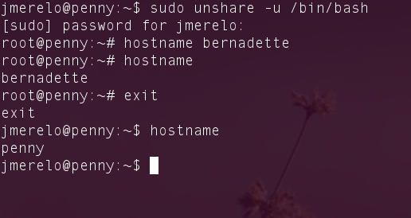

Técnicas de virtualización
==

<!--@
prev: Intro_concepto_y_soporte_fisico
next: Contenedores
-->

Cubre los siguientes objetivos de la asignatura
---

* Conocer los conceptos relacionados con el proceso de virtualización
  tanto de software como de hardware. 

* Conocer las diferentes tecnologías y herramientas de virtualización
  tanto para procesamiento, comunicación y almacenamiento. 
  
 * Configurar los diferentes dispositivos físicos para acceso a los
  servidores virtuales: acceso de usuarios, redes de comunicaciones o entrada/salida.

* Realizar tareas de administración en infraestructura virtual.

<h2>Objetivos específicos</h2>

1.  Conocer las diferentes tecnologías y herramientas de
virtualización tanto para procesamiento, comunicación y
almacenamiento. 

2. Crear infraestructuras virtuales básicas: dispositivos.

3. Aislar recursos (incluyendo todos los relacionados con un usuario) usando *jaulas* a base de órdenes del sistema y diferentes utilidades.

Introducción
------------------

Una vez vista la introducción a la infraestructura virtual y algunas
técnicas usadas por la misma, en este tema pondremos en práctica lo
anterior trabajando con diferentes técnicas de virtualización a nivel
de sistema operativo y a nivel de hardware.

Comenzaremos por aprender a usar *contenedores*, un entorno de
virtualización a nivel de sistema operativo que permite trabajar con
muchas de las técnicas habituales en virtualización sin introducir un
*overhead* excesivo; previamente veremos los mecanismos incluidos en
el núcleo que permiten construirlos.

Espacios de nombres
-------------------------------

Los
[espacios de nombres o *namespaces* del núcleo](http://lwn.net/Articles/531114/)
son un mecanismo que permite aislar el identificador asignado a una
serie de recursos del resto del sistema. Por ejemplo, se puede
identificar un número de proceso (PID) independiente, que puede
coincidir con otro existente en otro espacio de nombres, o se puede
montar un recurso de forma que sea invisible al resto del sistema o
simplemente tenga un nombre diferente.

Hay seis tipos de *namespaces*, algunso de los cuales son
relativamente modernos y otros proceden de las versiones 2.4 y 2.6 del
núcleo:

* De montaje, aislan los recursos declarados con `mount`.
* UTS (el acrónimo viene de *Unix Time Sharing System*, sistemas de
  virtualización tempranos), básicamente los nombres del ordenador y
  su dominio.
* IPC o *inter-process communication*, referidos a los *sockets* y
    colas de mensajes.
* PID o identificadores de proceso.
* Red, los recursos relacionados con la red, números de puerto y
      demás.
* Usuario, lo que puede permitir, por ejemplo, que un proceso
        tenga privilegios de `root` dentro del espacio de nombres de
        un usuario y no los tenga fuera, creando contenedores de
        recursos.
		
La mayor parte de estos espacios de nombres se pueden asignar a una
nueva orden usando una llamada del sistema `CLONE`. Pero desde línea
de órdenes se pueden crear diferentes espacios de nombres usando
`unshare`, que está dentro del paquete `util-linux` (es posible que se
llame de otra forma en diferentes distribuciones) como
[cuentan en este blog](http://karelzak.blogspot.com.es/2009/12/unshare1.html). Por
ejemplo, podemos cambiar el nombre de la máquina:

Primero, se ha usado

	sudo unshare -u /bin/bash
   
En este caso, `-u` indica que vamos a crear un nuevo *namespace* UTS,
que nos permite cambiar el nombre de la máquina. Eso es lo que
hacemos: cambiamos el nombre de la máquina, y comprobamos que al salir
de la orden que había ejecutado, el intérprete de órdenes, se vuelve a
restaurar el nombre original. 

Crear un espacio de nombres y montar en él una imagen ISO de un CD de
forma que no se pueda leer más que desde él. *Pista*: en
[ServerFault](http://serverfault.com/questions/198135/how-to-mount-an-iso-file-in-linux)
nos explican como hacerlo, usando el dispositivo *loopback*

El mecanismo de espacios de nombres es diferente al usado en 
[`cgroups`](Intro:concepto_y_soporte_fisico#restriccin_y_medicin_del_uso_de_recursos_),
tal como se vio en el tema anterior: teóricamente, un PID dentro de un
CGROUP es visible a todos los demás procesos; sin embargo, es
complementario porque mientras que uno aisla la visibilidad o el
ámbito otro aisla o limita el uso de recursos. Por ello constituyen la
base de los contenedores que se verán en este tema. 

`unshare`tiene sus limitaciones, y la principal es que sólo se puede
*entrar* en un *namespace* ejecutando un comando, no "desde fuera". A
partir de la versión 2.23 de util-linux (la versión en mi Ubuntu 12.04
es la 2.20) [un nuevo comando `nsenter`](http://karelzak.blogspot.com.es/2013/04/umount8-mount8-and-nsenter1.html) permitirá entrar dando el
PID del proceso dentro del que se haya creado. 

Los espacios de nombres permiten aislar todo tipo de aplicaciones; en
[este manual explican cómo aislar un marco web denominado uWSCGI y su centro de control](http://uwsgi-docs.readthedocs.org/en/latest/Namespaces.html). 

Puentes de red
----------------------

Tras las técnicas que se han visto de aislamiento y
compartimentalización de recursos hace falta ver alguna forma de crear
una *tarjeta de red virtual* para esos recursos, de forma que puedan
conectarse al exterior a través de la tarjeta de red del ordenador
anfitrión o entre sí entre diferentes máquinas virtuales del mismo
anfitrión. Además de actuar como tal, el interfaz de red virtual
tendrá que actuar como *puente*, enrutando todos los paquetes Ethernet
del invitado al anfitrió o a donde corresponda. Por eso las máquinas
virtuales usan interfaces de red virtuales llamados *puentes*. Para
usarlos necesitaremos instalar un [paquete de linux (y sus
dependencias) denominado `bridge-utils`](http://www.linuxfromscratch.org/blfs/view/svn/basicnet/bridge-utils.html).

La principal orden que provee este paquete es [`brctl` que podemos usar
directamente](https://wiki.debian.org/BridgeNetworkConnections) para crear este puente.

	sudo brctl addbr alcantara

Hace falta privilegios de superusuario para crear este nuevo interfaz;
una vez creado, 

	 ip addr show

nos mostrará, entre otras cosas

	alcantara: <BROADCAST,MULTICAST> mtu 1500 qdisc noop state DOWN 
    link/ether 0a:f5:42:80:e7:09 brd ff:ff:ff:ff:ff:ff
	
en este instante ni está activado ni, en realidad, hace nada: no tiene
dirección ethernet, aunque sí un MAC propio. Este puente podemos, por
ejemplo, añadirlo a otro interfaz como el eth0 típico de cualquier
ordenador:

	sudo brctl addif alcantara eth0
	
Si mostramos de nuevo los interfaces con `ip addr show`, ahora
mostrará:

	eth0: <BROADCAST,MULTICAST,UP,LOWER_UP> mtu 1500 qdisc pfifo_fast	master alcantara state UP qlen 1000
	
es decir, el nombre del puente aparecerá en la descripción del mismo y
en el estado del puente aparecerá la MAC del interfaz al que está
conectada.

Ahora este interfaz actuará como cualquier otro a la hora de
configurarlo: podemos asignarle una IP fija o asignársela con DHCP
cuando se *levante*, pero en cuanlquier caso podremos usarlo como una
tarjeta de red virtual para las máquinas virtuales que vayamos a
usar. Es posible que si hemos instalado algún paquete de
virtualización ya tengamos alguna creada, `brctl show` muestra todos
los puentes que existen en una máquina, por ejemplo:

	bridge name	bridge id		STP enabled	interfaces
	alcantara		8000.1c6f65a40690	no		eth2
	lxcbr0		8000.000000000000	no		
	virbr0		8000.000000000000	yes		
	
Que muestra los puentes creados por `lxc` (que veremos más adelante) y
por VirtualBox.

1. Mostrar los puentes configurados en el sistema operativo.

2. Crear un interfaz virtual y asignarlo al interfaz de la tarjeta
wifi, si se tiene, o del fijo, si no se tiene.

La utilidad de la creación de puentes no se limita a su uso por
máquinas virtuales. Se puede usar, por ejemplo, para
[equilibrar la carga entre dos interfaces](http://archive09.linux.com/feature/133849)
o simplemente crear un sólo interfaz virtual que contenga los dos
interfaces reales presentes en el ordenador; también para simular
redes dentro de un sólo ordenador. 

Un
[video que explica los interfaces puente](http://www.youtube.com/watch?v=XivXeKxQ4KI).

Creando el contenido de nuevas máquinas y metiéndolos en jaulas
--------------------------------------------------------------

En el mundo del software libre y de las distribuciones de Linux
siempre es fácil añadir el contenido a una nueva máquina virtual; dado
que, en general, es "como" una máquina real basta con "arrancar" con
una ISO y llevar a cabo el proceso habitual de instalación. Sin
embargo, hacerlo conlleva una serie de problemas, el principal es que
es muy difícil que una instalación no necesite una parte interactiva
(nombres de usuario y claves, por ejemplo) y que, además, no se puede
controlar el proceso fácilmente desde otro sistema.

Además, en muchos casos no hace falta instalar un sistema completo,
sino sólo una parte; en alternativas de virtualización a nivel de
sistema operativo, como las que vamos a ver, hay partes del sistema
(núcleo, dispositivos) que se comparten y sólo hace falta instalar las
órdenes mínimas para dotar a la *máquina* de una serie de recursos
para funcionar.

por supuesto, una de las formas de hacerlo es simplemente ir copiendo
las partes necesarias del sistema de ficheros raíz al nuevo
sistema. Pero hay una serie de utilidades en Linux que lo hacen más
fácil. En el mundo Debian (que incluye Debian, Ubuntu y Guadalinex) se
usa `debootstrap`.

Una vez instalado, se puede usar de esta forma
	
		sudo debootstrap --arch=amd64 quantal /home/jaulas/quantal/	http://archive.ubuntu.com/ubuntu

La primera parte indica el tipo de arquitectura que se va a usar. Una
de las ventajas que tiene `debootstrap` es que puedes crear
instalaciones de 32 bits (`arch=i386`) dentro de un anfitrión de 64
bits (al revés, no, claro). El segundo argumento es el nombre de la
distro que se va a buscar en el repositorio, en este caso Quantal Quetzal. A continuación, el
directorio en el que lo vamos a instalar, que habremos creado
previamente, y finalmente la dirección del repositorio, que en este
caso de la de Ubuntu; la de Debian sería
`http://ftp.debian.org/debian/` y en el caso de Guadalinex sería un
tanto diferente, con diferentes directorios para cada distro, por
ejemplo `http://ftp.cica.es/Guadalinex/guadalinex-buho/`para Búho, la
última (aunque ya he probado que no funciona). 

En realidad, `debootstrap` es un conjunto de archivos del shell que
localizan la descripción de la distro y la descargan, y para hacer eso
tienen una serie de ficheros con las características de cada distro,
que en realidad se reducen a unos cuantos ficheros para las distros
debian y enlaces simbólicos a las mismas. Para cualquier otra distro
que sea parecida a Debian (por ejemplo, Guadalinex) habrá que buscar
la más cercana, pero sin garantía de éxito; por ello no se trata de
una herramienta universal, ni siquiera para todas las *debian-like*

Otras distros tienen herramientas similares, adaptadas a sus
características y sistemas de paquetes. Por ejemplo,
[`urpmi` se puede usar en Mandriva](http://wiki.mandriva.com/en/Development/Howto/Chroot)
(aunque es más bien un sistema para instalar paquetes en cualquier
sitio) y, aunque también existe en Fedora `febootstrap` lo más
flexible es usar
[`mock`](http://fedoraproject.org/wiki/Projects/Mock), aunque de hecho
`mock`va un poco más allá pudiendo trabajar directamente con las
jaulas `chroot`; otro sistema se denomina
[Rinse](http://www.steve.org.uk/Software/rinse/) y se puede usar, en
principio, en cualquier distribución basada en RPM y desde cualquier
distribución tipo Debian. Rinse tiene una línea de órdenes similar a
`debootstrap`, pero permite instalar sistemas tales como Fedora dentro
de una distro Debian y siempre que compartan el Kernel, como es
natural.  

1. Usar debootstrap (o herramienta similar en otra distro) para crear un
sistema mínimo que se pueda ejecutar más adelante. 

2. Experimentar con la creación de un sistema Fedora dentro de Debian
usando Rinse.

Una alternativa a `debootstrap` es
[`multistrap`](https://wiki.debian.org/Multistrap), una herramienta de
Debian mucho más flexible que permite, por ejemplo, mezclar diferentes
repositorios a la hora de crear una instalación a medida. Para que
funcione hay que crear un fichero de configuración de la instalación,
y configurar aspectos como los ficheros de dispositivo que se van a
usar, incluso prioridades. Para los propósitos de esta asignatura es
un poco avanzada, pero conviene al menos conocer que existe, igual que
[`cdebootstrap`](https://wiki.debian.org/cdebootstrap), una
implementación en C (en vez de scripts del shell, lo que tiene que
haber sido todo un infierno) de `debootstrap` y que en realidad se usa
sólo en imágenes de DebianInstaller. 

Un
[*screencast* (en inglés) que muestra cómo instalar Ubuntu 12.04 usando debootstrap](http://www.youtube.com/watch?v=xiM9GOKvTI4)

Una vez que la imagen está lista, los ordenadores con Linux permiten
crear una [jaula `chroot`](http://es.wikipedia.org/wiki/Chroot) , que
simplemente aisla a una serie de procesos en una parte del sistema de
ficheros, el `root` o raíz al que se cambia la jaula. En ese sentido,
es un mecanismo de virtualización menos seguro que otros, porque se
sigue teniendo acceso al resto de los recursos (dispositivos,
procesos), aunque el acceso estará limitado al que tenga el usuario
con el que se trabaje. Sin embargo, para ciertas aplicaciones de la
virtualización (por ejemplo, para crear entornos de prueba de
aplicaciones) es suficiente y no hace falta ningún mecanismo
adicional. De forma rutinaria se usa, por ejemplo, para prueba de
software o para empaquetado de recursos.

Una vez creada la instalación del sistema operativo, para *entrar* en
la jaula se usa `chroot`

	sudo chroot /home/jaulas/raring
	
indicándole el directorio donde se encuentra. Nos encontraremos con
una línea de órdenes como esta:
	
	root@penny:/# 

que, al listar el contenido nos mostrará

	bin   dev  home  lib64	mnt  proc  run	 selinux  sys  usr
	boot  etc  lib	 media	opt  root  sbin  srv	  tmp  var

La máquina tal como está es usable, pero no está completa. Por
ejemplo, `top` dará un error:

	Error, do this: mount -t proc proc /proc
	
Así que [una de las cosas que hay que hacer](https://help.ubuntu.com/community/BasicChroot) es montar el filesystem
virtual `/proc` exactamente como dice ahí. Lo que se está montando es
el filesystem tipo proc (el primero) en el subdirectorio proc (el
segundo) y usando `/proc` de la máquina anfitriona. Esto lo podemos
hacer, por supuesto, si estamos trabajando con permisos de
superusuario.

Otro de los problemas será la configuración del Locale; muchos
comandos darán un error indicando que no está
establecido. [Otros pasos resolverán este tema, incluyendo la instalación de los Locales necesarios](https://wiki.ubuntu.com/DebootstrapChroot). Habrá
que actualizar la distribución, los locales, y configurarlos. 

	apt-get install language-pack-es
	
Esto instala el paquete español que básicamente evita que nos dé una
serie de errores. Puede que haya que instalar alguna cosa más, pero
con esto evitamos los errores más comunes.

Instalar alguna sistema debianita y configurarlo para su
uso. Trabajando desde terminal, probar a ejecutar alguna aplicación o
instalar las herramientas necesarias para compilar una y ejecutarla. 

Para añadir un usuario que trabaje dentro de esta jaula hay que usar
un . en su directorio home; automáticamente cuando se conecte
"aparecerá" dentro de la misma:

	sudo useradd -s /bin/bash -m -d /home/jaulas/raring/./home/rjmerelo -c "Raring jmerelo" -g users rjmerelo
	
Sin necesidad de usar el comando chroot, al conectarte como ese
usuario (abriendo un terminal o bien con `su - rjmerelo`) se ejecutará
directamente dentro de la misma. Esto se puede usar para crear
usuarios poco privilegiados para ejecutar shells restringidos o
servicios como `sftp` o un servidor web. 

Hay que tener en cuenta que si este usuario no está definido *dentro
de la jaula* al acceder directamente a la misma (mediante un
*contenedor* de los que se verán más adelante, por ejemplo) no se
podrá usar. Esta es una de las principales diferencias entre las
jaulas `chroot` y los contenedores (que se verán más adelante): las primeras no necesitan usuarios
definidos, porque se ejecutan como una serie de procesos del anfitrión
con limitaciones en el acceso al sistema de ficheros; sin embargo, un
*contenedor* se ejecuta como una máquina completa. Por tanto, si se quiere usar una
jaula como tal una de las cosas que habrá que hacer es, precisamente,
definir usuarios y darle privilegios.

Instalar una jaula chroot para ejecutar el servidor web de altas
prestaciones `nginx`.

Usar un simple `chroot` va bien siempre que no tengamos diferentes entornos y no sea
el usuario quien tenga que usarlos. Otras órdenes como
[`schroot`](http://linuxgazette.net/150/kapil.html) permiten trabajar
con varios entornos fácilmente y gestionarlos desde la línea de
órdenes, refiriéndonos a ellos por nombres o aliases.

Este
[video de unos 20 minutos y de LinuxMagazineSpain](http://www.youtube.com/watch?v=Hk8nxDZ2wjY)
explica el concepto de chroot y cómo instalarlo. Se enrolla un poco
más de la cuenta, pero es más o menos completo.

Lo primero que hay que hacer es crear una definición para cada uno de
los entornos en el fichero `/etc/schroot/schroot.conf` tal como esta:

	[quantal]
	description=Quantal Quetzal (Ubuntu)
	location=/home/jaulas/quantal
	type=directory
	users=jmerelo
	root-groups=root
	root-users=root
	aliases=ubuntu1210
	run-setup-scripts=true
	run-exec-scripts=true
	
[Esta configuración](https://wiki.debian.org/Schroot) define un
entorno llamado `quantal` con alias `ubuntu1210` que está en el
directorio que se indica y que puede ser usado, aparte de por el
superusuario, por el usuario
jmerelo. [Las opciones completas están en la página de manual](http://manpages.ubuntu.com/manpages/maverick/en/man1/schroot.1.html),
pero, en general, `schroot` añade sólo un poco de conveniencia para
usuarios, no nuevas capacidades.

En la familia
[BSD existe Warden](http://wiki.pcbsd.org/index.php/Warden%C2%AE), una
utilidad con interfaz gráfico que permite crear jaulas tanto BSD como
Linux; con la limitación, por supuesto, de que la versión Linux tenga
el mismo núcleo.

El problema que tienen las jaulas es que es relativamente difícil
crearlas de forma automática con los servicios y aplicaciones que
necesite un usuario particular. Hay que crear la jaula y una vez hecho
entrar en la misma y comenzar a configurar e instalar. Es algo que se
puede automatizar con scripts pero que posiblemente necesite
intervención humana en algún momento. Por eso se han creado
herramientas como [`jailkit`](http://olivier.sessink.nl/jailkit/),
cuya principal intención es crear jaulas con usuarios o servicios
limitados a las mismas. 

`jailkit` no tiene paquetes "oficiales" para ninguna distro pero se
puede descargar de la página e instalarse fácilmente con `./configure
&& make && sudo make install`

La idea principal de `jailkit` es realizar una jaula de la forma más
segura posible, por eso se basa en copiar sólo y exclusivamente los
ficheros necesarios para ejecutar lo que se quiera ejecutar. En el
fichero de configuración tiene una serie de configuraciones comunes
que se pueden usar, pero para el resto hay que editar ese fichero
incluyendo las dependencias o ficheros necesarios. Para usarlo, por
tanto, hay que crear un sistema de ficheros *poseído* por `root`:

	mkdir -p /seguro/jaulas/dorada
	chown -R root:root /seguro
	
Y a partir de ahí 

	jk_init -v -j /seguro/jaulas/dorada jk_lsh basicshell netutils editors

En esta orden `-v` indica que se muestren todos los mensajes (para que
se vea que se está haciendo) y `-j` indica el directorio donde se
encuentra la jaula. Los comandos son alias de lo que se va a instalar
en la jaula; `editors`, por ejemplo, instala una serie de editores y
las dependencias pertinentes. A estos alias se le denominan
*secciones* y se refieren a la parte correspondiente del fichero de
configuración. 

Esta jaula se puede usar directamente con `chroot`, pero [jailkit
también permite *enjaular* usuarios](http://www.binarytides.com/setup-a-jail-shell-with-jailkit-on-ubuntu/). Tras
crear el usuario de la forma habitual
en Linux

	sudo jk_jailuser -m -j /seguro/jaulas/dorada alguien
	
Todavía no queda la cosa ahí, porque aunque este usuario existe en la
jaula, no se podrá conectar con el shell limitado que tiene. Habrá que
editar la configuración del usuario (que estará en
`/seguro/jaulas/dorada/etc/passwd`) y cambiar `jk_lsh` por
`/bin/bash`, el shell habitual. Una vez hecho todo esto, te puedes
conectar por ssh a tu propia máquina usando el nombre de usuario y
clave creada o bien sacar un terminal con Ctrl-Alt-F1 o Ctrl-Alt-F2
usando este nombre de usuario.

Crear una jaula y enjaular un usuario usando `jailkit`, que previamente se habrá tenido que instalar. 

Unas
[cuantas cosas que se pueden hacer con jailkit](http://olivier.sessink.nl/jailkit/howtos_chroot_shell.html)
y
[prácticas de seguridad](http://www.unixwiz.net/techtips/chroot-practices.html).

Dado que las jaulas contienen, en realidad, sistemas completos, se
pueden usar más adelante para incluirlas en *tápers* o
*contenedores*. La diferencia no está en cómo está constituida la
jaula, sino en cómo se accede a ella. Sin embargo, las técnicas
necesarias para crear un sistema con virtualización completa son
diferentes y se verán más adelante.

A dónde ir desde aquí
-----

En el [siguiente tema](Contenedores.md) se verá cómo trabajar con
sistemas *ligeros* de virtualización.

